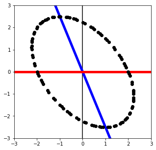

# Linear Algebra

- Linear Algebra and Its Applications, 6th Edition 의 내용을 정리하였다

*****

## Chapter 1 : Linear Equations in Linear Algebra

### 1) System of Linear Equations

linear equation : $a_1x_1 + a_2x_2 + \cdots + a_nx_n = b$ where $b$ and the coefficients $a_1,...,a_n$ are real or complex numbers <br>
A system of linear equations (linear system) : collection of linear equations involving the same variables
- solution of the linear system : a list $(s_1,...,s_n)$ that makes each equation a true statement when $s_1,...,s_n$ is substituted for $x_1,...,x_n$ 
- solution set of the linear system : the set of all possible solutions
  - equivalent : Two linear systems have the same solution set
  - consistent : A system of linear equations has unique solution or infinitely many solutions
  - inconsistent : A system of linear equations has no solution
  
The essential information of a linear system can be recorded compactly in a rectangular array called a matrix
- A system of linear equations <br>
  $1x_1 - 2x_2 + 1x_3 = \ \ 0$ <br>
  $0x_1 + 2x_2 - 8x_3 = \ \ 8$ <br>
  $5x_1 + 0x_2 - 5x_3 = 10$ 
- coefficient matrix ( matrix of coefficients ) <br>
  $\begin{bmatrix} 1 & -2 & 1 \\\ 0 & 2 & -8 \\\ 5 & 0 & -5 \end{bmatrix}$
- augment matrix <br>
  $\begin{bmatrix} 1 & -2 & 1 & 0 \\\ 0 & 2 & -8 & 8 \\\ 5 & 0 & -5 & 10 \end{bmatrix}$
  
elementary row operations
- (Replacement) replace one row by the sum of itself and a multiple of another row
- (Interchange) Interchange two rows
- (Scaling) Multiply all entries in a row by a nonzero constant

row equivalent : there is a sequence of elementary row operations that transforms one matrix into the other <br>
a system that is changed to a new one via row operation can be returned to original system via row operation. therefore, <br>
If the augmented matrices of two linear systems are row equivalent, then the two systems have the same solution set

### 2) Row Reduction and Echelon Forms

reduced (row) echelon form [ 1 ~ 3 : (row) echelon form ]
1. All nonzero rows are above any rwos of all zeros
2. Each leading entry of a row is in a column to the right of the leading entry of the row above it
3. All entries in a column below a leading entry are zeros
4. The leading entry in each nonzero row is $1$.
5. Each leading $1$ is the only nonzero entry in its column

Theorem 1 (Uniqueness of the Reduced Echelon Form) <br>
: Each matrix is row equivalent to one and only one reduced echelon matrix

pivot position in $A$ : a location in $A$ that corresponds to a leading 1 in the reduced echelon form of A <br>
A nonzero entry, or pivot, must be placed in pivot position <br>

pivot column of $A$ : a column of $A$ that contains a pivot position <br>

Solutions of Linear Systems
- basic variable : The variables corresponding to pivot columns in the matrix
- free variable : The other variable  [ we are free to choose any value for this varaible ]

Theorem 2 (Existence and Uniquenesss Theorem)
- A linear system is consistent if and only if an echelon form of the augmented matrix has no row of the form <br>
  $\begin{bmatrix} 0 & \cdots & 0 & b \end{bmatrix}$ with $b$ nonzero
- If linear system is consistent
  - If there are no free variables, then the solution set contains a unique solution
  - If there is at least one free variable, then the solution set contains infinitely many solutions

### 3) Vector Equations

A matrix with only one column is called a column vector or simply a vector <br>
For all $u, v, w$ in $R^n$ and all scalars $c$ and $d$:
- $u+v = v+u$
- $(u+v)+w = u+(v+w)$
- $u+0=0+u=u$
- $u+(-u)=-u+u=0$ where $-u$ denotes $(-1)u$
- $c(u+v) = cu+cv$
- $(c+d)u = cu+du$
- $c(du) = (cd)u$
- $1u = u$

linear combination of $v_1,...,v_p$ with weights $c_1,...,c_p$ : $y = c_1v_1 + \cdots + c_pv_p$ <br>
- A vector equation $x_1a_1 + x_2a_2 + \cdots + x_na_n = b$ has the same solution set <br>
  as the linear system whose augmented matrix is $\begin{bmatrix} a_1 & a_2 & \cdots & a_n & b \end{bmatrix}$
- In particular, $b$ can be generated by a linear combination of $a_1,...,a_n$ if and only if <br>
  there exists a solution to the linear system corresponding to the above matrix

If $v_1,...,v_p$ are in $R^n$, then the set of all linear combinations of $v_1,...,v_p$ is decoted by Span $\{v_1,...,v_p\}$ <br>
and is called the subset of $R^n$ spanned (generated) by $v_1,...,v_p$ <br>
That is, Span$\{v_1,...,v_p\}$ is the collection of all vectors that can be written in the form <br>
$c_1v_1 + c_2v_2 + \cdots + c_pv_p$ with $c_1,...,c_p$ scalars

### 4) The Matrix Equation

If $A$ is an $m \times n$ matrix, with columns $a_1, ..., a_n$, and if $x$ is in $R^n$, <br>
then $Ax$ is the linear combination of the columns of $A$ using the corresponding entries in $x$ as weights 
- Theorem 3
  - If $b$ is in $R^m$, the matrix equation $Ax = b$ has the same solution set <br>
    as the vector equation $x_1a_1 + x_2a_2 + \cdots + x_na_n = b$
- Theorem 4 : for a particular $A$, the following statements are logically equivalent
  - For each $b$ in $R^m$, the equation $Ax = b$ has a solution
  - Each $b$ in $R^m$ is a linear combination of the columns of $A$
  - The columns of $A$ span $R^m$
  - $A$ has a pivot position in every row
  
Theorem 5 : If $A$ is an $m \times n$, $u$ and $v$ are vectors in $R^n$, and $c$ is a scalar, then: <br>
- $A(u+v) = Au+Av$
- $A(cu) = c(Au)$

### 5) Solution Sets of Linear Systems

A system of linear euqations is homogeneous : it can be written in the form $Ax = 0$
- trivial solution : $Ax = 0$ always has at least one solution, namely $x = 0$
- nontrivial solution : nonzero vector $x$ that satisfies $Ax = 0$
  - $Ax = 0$ has a nontrivial solution if and only if the equation has at least one free variable

Let's describe all solutions of $Ax = b$, where $A = \begin{bmatrix} 3 & 5 & -4 \\\ -3 & -2 & 4 \\\ 6 & 1 & -8 \end{bmatrix}$ and $b = \begin{bmatrix} 7 \\\ -1 \\\ -4 \end{bmatrix}$
- $\begin{bmatrix} A & b \end{bmatrix} = \begin{bmatrix} 3 & 5 & -4 & 7 \\\ -3 & -2 & 4 & -1 \\\ 6 & 1 & -8 & -4 \end{bmatrix} ~ \begin{bmatrix} 1 & 0 & -4/3 & -1 \\\ 0 & 1 & 0 & 2 \\\ 0 & 0 & 0 & 0 \end{bmatrix}$
- therefore, $x = \begin{bmatrix} x_1 \\\ x_2 \\\ x_3 \end{bmatrix} = \begin{bmatrix} -1 + (4/3)x_3 \\\ 2 \\\ x_3 \end{bmatrix} = \begin{bmatrix} -1 \\\ 2 \\\ 0 \end{bmatrix} + \begin{bmatrix} (4/3)x_3 \\\ 0 \\\ x_3 \end{bmatrix} = \begin{bmatrix} -1 \\\ 2 \\\ 0 \end{bmatrix} + x_3 \begin{bmatrix} 4/3 \\\ 0 \\\ 1 \end{bmatrix}$
- therefore, the solution set of $Ax = b$ in parametric vector form is $x = p + tv$ <br>
  where $p = \begin{bmatrix} -1 \\\ 2 \\\ 0 \end{bmatrix}$, $v = \begin{bmatrix} 4/3 \\\ 0 \\\ 1 \end{bmatrix}$, and $t$ is in $R$, because $x_3$ is free variable
- and, the solution set of $Ax = 0$ in parametric vector form is $x = tv$ <br>
  because $p$ is the solution of $Ax = b$, and $v$ is the solution of $Ax = 0$
- Theorem 6
  - Suppose the equation $Ax = b$ is consistent for some given $b$, and let $p$ be a solution
  - Then the solution set of $Ax = b$ is the set of all vectors of the form $w = p + v_h$, <br>
    where v_h is any solution of the homogeneous equation $Ax = 0$

### 6) Applications of Linear Systems

(pdf 87p 13번 문제로, 나중에 img 따로 넣자) <br>

$A : 30 + x_2 = 80 + x_1 \Longrightarrow -x_1 + x_2 = 50$ <br>
$B : x_3 + x_5 = x_2 + x_4 \Longrightarrow -x_2 + x_3 - x_4 + x_5 = 0$ <br>
$C : 100 + x_6 = 40 + x_5 \Longrightarrow -x_5 + x_6 = -60$ <br>
$D : 40 + x_4 = 90 + x_6 \Longrightarrow x_4 - x_6 = 50$ <br>
$E : 60 + x_1 = 20 + x_3 \Longrightarrow x_1 - x_3 = -40$ <br>
<br>
row reduce the augmented matrix of the linear system: <br>
$\begin{bmatrix}
-1 & 1 & 0 & 0 & 0 & 0 & 50 \\\
0 & -1 & 1 & -1 & 1 & 0 & 0 \\\
0 & 0 & 0 & 0 & -1 & 1 & -60 \\\
0 & 0 & 0 & 1 & 0 & -1 & 50 \\\
1 & 0 & -1 & 0 & 0 & 0 & -40
\end{bmatrix}$
~
$\begin{bmatrix}
1 & 0 & -1 & 0 & 0 & 0 & -40 \\\
0 & 1 & -1 & 0 & 0 & 0 & 10 \\\
0 & 0 & 0 & 1 & 0 & -1 & 50 \\\
0 & 0 & 0 & 0 & 1 & -1 & 60 \\\
0 & 0 & 0 & 0 & 0 & 0 & 0
\end{bmatrix}$
, <br>
$\therefore x = \begin{bmatrix} x_1 \\\ x_2 \\\ x_3 \\\ x_4 \\\ x_5 \\\ x_6 \end{bmatrix}
= \begin{bmatrix} x_3 - 40 \\\ x_3 + 10 \\\ x_3 \\\ x_6 + 50 \\\ x_6 + 60 \\\ x_6 \end{bmatrix}
= \begin{bmatrix} -40 \\\ 10 \\\ 0 \\\ 50 \\\ 60 \\\ 0 \end{bmatrix} + x_3 \begin{bmatrix} 1 \\\ 1 \\\ 1 \\\ 0 \\\ 0 \\\ 0 \end{bmatrix} + x_6 \begin{bmatrix} 0 \\\ 0 \\\ 0 \\\ 1 \\\ 1 \\\ 1 \end{bmatrix}$, where $x_3 \geq 40$

### 7) Linear Independence

An indexed set of vectors $\{v_1,..,v_p\}$ in $R^n$ is said to be
- linearly independent : $x_1v_1 + x_2v_2 + \cdots + x_pv_p = Ax = 0 \ $ has only the trivial solution <br>
- linearly dependent : there exist weights $c_1,...,c_p$, not all zero, such that $c_1v_1 + c_2v_2 + \cdots + c_pv_p = 0$
  - $c_1v_1 + c_2v_2 + \cdots + c_pv_p = 0$ is called a linear dependence relation
  
Theorem 7 : Characterization of Linearly Dependent Sets
- An indexed set $S = \{v_1,...,v_p\}$ of two or more vectors is linearly dependent if and only if <br>
  at least one of the vectors in $S$ is a linear combination of the others.
- if S is linearly dependent and $v_1 \neq 0$, <br>
  then some $v_j$ (with $j>1$) is a linear combination of the preceding vectors, $v_1,...,v_{j-1}$
  
Theorem 8 : If a set contains more vectors than there are entries in each vector, then the set is linearly dependent
- any set $\{v_1,...,v_p\}$ in $R^n$ is linearly dependent if $p > n$

Theorem 9 : If a set $S = \{v_1,...,v_p\}$ in $R^n$ contains the zero vector, then the set is linearly dependent

### 8) Introduction to Linear Transformations

Transformation (function, mapping) $\ T : V \rightarrow W$ : a rule that assigns to each vector $x$ in $V$ a vector $T(x)$ in $W$
- domain of $T$ : $V$
- codomain of $T$ : $W$
- image of $x$ : the vector $T(x)$
- range of $T$ : the set of all images $T(x)$

Linear Transformation : transformation $T$ that has the properties
- $T(u+v) = T(u) + T(v)$ for all $u, v$ in the domain of $T$
- $T(cu) = cT(u)$ for all scalars $c$ and all $u$ in the domain of $T$

Matrix Transformation : $T(x) = Ax$ where $A$ is an $m \times n$ matrix, denoted by $x \mapsto Ax$
- The range of $T$ is the set of all linear combinations of the columns of $A$
- Every matrix transformation is linear transformation

### 9) The Matrix of a Linear Transformation

Theorem 10
- Let $T : R^n \rightarrow R^m$ be a linear transformation. <br>
  Then there exists a unique matrix $A$ such that $T(x) = Ax$ for all $x$ in $R^n$
- $A$ is the $m \times n$ matrix whose $j$th column is the vector $T(e_j)$, where $e_j$ is the $j$th column of the identity matrix in $R^n$: <br>
  $A = \begin{bmatrix} T(e_1) & \cdots & T(e_n) \end{bmatrix}$, called by the standard matrix for $T$
- Warning : Every linear transformation is not matrix transformation
  - $T$ is matrix transformation if $T$ is linear transformation from $R^n$ to $R^m$

A mapping $T : R^n \rightarrow R^m$ is said to be
- onto : each $b$ in $R^m$ is the image of at **least** one $x$ in $R^n$
  - if $T(x) = Ax$, then 'onto' is that $Ax = b$ has a solution for each $b$
- one-to-one : each $b$ in $R^m$ is the image of at **most** one $x$ in $R^n$
  - if $T(x) = Ax$, then 'one-to-one' is that $Ax = b$ has not a free variable

Theorem 11 : Let $T : R^n \rightarrow R^m$ be a linear transformation. Then:
- $T$ is one-to-one if and only if the equation $T(x) = 0$ has only the trivial solution

Theorem 12 : Let $T : R^n \rightarrow R^m$ be a linear transformation, and let $A$ be the standard matrix for $T$. Then:
- $T$ maps $R^n$ onto $R^m$ if and only if the columns of $A$ span $R^m$
- $T$ is one-to-one if and only if the columns of $A$ are linearly independent

### 10) Linear Models in Business, Science, and Engineering

In a certain region, about 7% of a city's population moves to the surrounding suburbs each year, <br>
and about 5% of the suburban population moves into the city. <br>
In 2020, there were 800,000 residents in the city and 500,000 in the suburbs. <br>
Set up a difference equation that describes this situation, where $x_0$ is the initial population in 2020. <br>
Then estimate the populations in the city and in the suburbs two years later, in 2022
- $x_0 = \begin{bmatrix} city \\\ suburbs \end{bmatrix} = \begin{bmatrix} 800,000 \\\ 500,000 \end{bmatrix}$
- difference equation (recurrence relation) : $x_{k+1} = Mx_k$ for $k = 0, 1, 2, ...$ 
  - migration matrix $M = \begin{bmatrix} city \rightarrow city & suburbs \rightarrow city \\\ city \rightarrow suburbs & suburbs \rightarrow subrubs \end{bmatrix} = \begin{bmatrix} 0.93 & 0.05 \\\ 0.07 & 0.95 \end{bmatrix}$
- $\therefore \ x_2 = {\begin{bmatrix} 0.93 & 0.05 \\\ 0.07 & 0.95 \end{bmatrix}}^2 x_0 = \begin{bmatrix} 741,720 \\\ 558,280 \end{bmatrix}$

*****

## Chapter 2 : Matrix Algebra

### 1) Matrix Operations

Theorem 1 : Let $A$, $B$, and $C$ be matrices of the same size, and let $r$ and $s$ be scalars
- $A+B = B+A$
- $(A+B)+C = A+(B+C)$
- $A+0 = A$
- $r(A+B) = rA + rB$
- $(r+s)A = rA + sA$
- $r(sA) = (rs)A$

If $A$ is an $m \times n$ matrix, and if $B$ is an $n \times p$ matrix with columns $b_1,...,b_p$, <br>
then the product $AB$ is the $m \times p$ matrix whose columns are $Ab_1,...,Ab_p$. <br>
that is, $AB = A \begin{bmatrix} b_1 & b_2 & \cdots & b_p \end{bmatrix} = \begin{bmatrix} Ab_1 & Ab_2 & \cdots & Ab_p \end{bmatrix}$
- $(AB)_{ij} = a_{i1}b_{1j} + a_{i2}b_{2j} + \cdots + a_{in}b_{nj}$

Theorem 2 : Let $A$ be an $m \times n$ matrix, and let $B$ and $C$ have sizes for which the indicated sums and products are defined
- $A(BC) = (AB)C$  
- $A(B+C) = AB+AC$
- $(B+C)A = BA+CA$
- $r(AB) = (rA)B = A(rB)$ for any scalar $r$
- $I_m A = A = A I_n$

Theorem 3 : Let $A$ and $B$ denote matrices whose sizes are appropriate for the following sums and products
- $(A^T)^T = A$
- $(A+B)^T = A^T + B^T$
- $(rA)^T = r A^T$ for any scalar $r$
- $(AB)^T = B^TA^T$
  - Let $A = \begin{bmatrix} a_1 \\\ a_2 \\\ \vdots \\\ a_m \end{bmatrix}$ where $a_i$ is row vector in $R^n$, and $B = \begin{bmatrix} b_1 & b_2 & \cdots & b_p \end{bmatrix}$ where $b_j$ is column vector in $R^n$ 
  - $(AB)^T = {\begin{bmatrix} a_1b_1 & a_1b_2 & \cdots & a_1b_p \\\
                               a_2b_1 & a_2b_2 & \cdots & a_2b_p \\\
                               \vdots & \vdots & \ddots & \vdots \\\
                               a_mb_1 & a_mb_2 & \cdots & a_mb_p \end{bmatrix}}^T
             = \begin{bmatrix} a_1b_1 & a_2b_1 & \cdots & a_mb_1 \\\
                               a_1b_2 & a_2b_2 & \cdots & a_mb_2 \\\
                               \vdots & \vdots & \ddots & \vdots \\\
                               a_1b_p & a_2b_p & \cdots & a_mb_p \end{bmatrix}$
  - $B^TA^T = \begin{bmatrix} b_1 \\\ b_2 \\\ \vdots \\\ b_p \end{bmatrix} \begin{bmatrix} a_1 & a_2 & \cdots & a_m \end{bmatrix}
             = \begin{bmatrix} a_1b_1 & a_2b_1 & \cdots & a_mb_1 \\\
                               a_1b_2 & a_2b_2 & \cdots & a_mb_2 \\\
                               \vdots & \vdots & \ddots & \vdots \\\
                               a_1b_p & a_2b_p & \cdots & a_mb_p \end{bmatrix}$

### 2) The Inverse of a Matrix

Theorem 4 : Let $A = \begin{bmatrix} a & b \\\ c & d \end{bmatrix}$
- If $ad - bc \neq 0$, then $A$ is invertible and $A^{-1} = \frac{1}{ad-bc} \begin{bmatrix} d & -b \\\ -c & a \end{bmatrix}$
- If $ad - bc = 0$, then $A$ is not invertible

Theorem 5 : If $A$ is invertible $n \times n$ matrix, then the equation $Ax = b$ has the unique solution $x = A^{-1}b$ for each $b$ in $R^n$

Theorem 6
- if $A$ is an invertible matrix, then $A^{-1}$ is invertible and $(A^{-1})^{-1} = A$
- If $A$ and $B$ are $n \times n$ invertible matrices, then so is $AB$, and $(AB)^{-1} = B^{-1}A^{-1}$
  - Conversely, If $AB$ is invertible, then there exists $C$ such that $(AB)C = I$ and $C(AB) = I$ <br>
    $\Rightarrow A(BC) = I$ and $(CA)B = I$. Therefore by The Invetible Matrix Theorem, $A$ and $B$ is invertible <br>
    and $(AB)^{-1} AB = I \Rightarrow (AB)^{-1} = B^{-1}A^{-1}$ 
- If $A$ is an invertible matrix, then so is $A^T$, and $(A^T)^{-1} = (A^{-1})^T$
  - $(A^{-1})^T A^T = (A A^{-1})^T = I$ and $(A^T)^{-1} A^T = I$ $ \ \Longrightarrow \ (A^T)^{-1} = (A^{-1})^T$
  
elementary matrix : one that is obtained by performing a single elementary row operation on an identity matrix
- since row operations are reversible, each elementary matrix $E$ is invertible

Theorem 7
- An $n \times n$ matrix $A$ is invertible if and only if $A$ is row equivalent to $I_n$
- any sequence of elementary row operations that reduces $A$ to $I_n$ also transforms $I_n$ into $A^{-1}$
  - if $A$ is invertible, then $Ax = b$ has a solution for each $b$ (Theorem 5) <br>
    so that $A$ has a pivot position in every row (Theorem 4 in Chapter 1)
  - and since $A$ is square matrix, the reduced echelon form of $A$ is $I_n$ <br>
    so that $A$ ~ $E_1A$ ~ $E_2(E_1A)$ ~ $\cdots$ ~ $E_p(E_{p-1} \cdots E_1A) = E_p \cdots E_1A = I_n$ <br>
    $\Longrightarrow A = (E_p \cdots E_1)^{-1} I_n = (E_p \cdots E_1)^{-1} \Longrightarrow A^{-1} = E_p \cdots E_1 = E_p \cdots E_1 I_n$
  - $\therefore E_p \cdots E_1$ transform not only $A$ to $I_n$, but also $I_n$ into $A^{-1}$ <br>
    so that $\begin{bmatrix} A & I \end{bmatrix}$ ~ $\begin{bmatrix} I & A^{-1} \end{bmatrix}$

### 3) Characterizations of Invertible Matrices

Theorem 8 ( The Invertible Matrix Theorem ) : Let $A$ be a square $n \times n$ matrix. Then the following statements are equivalent.
1. $A$ is an invertible matrix
2. $A$ is row equivalent to the $n \times n$ identity matrix 
3. $A$ has $n$ pivot positions 
4. The equation $Ax = 0$ has only the trivial solution
5. The columns of $A$ form a linaerly independent set
6. The linear transformation $x \mapsto Ax$ is one-to-one
7. The equation $Ax = b$ has at least one solution for each $b$ in $R^n$
8. The columns of $A$ span $R^n$
9. The linear transformation $x \mapsto Ax$ maps $R^n$ onto $R^n$
10. There is an $n \times n$ matrix $C$ such that $CA = I$
11. There is an $n \times n$ matrix $D$ such that $AD = I$
12. $A^T$ is an invertible matrix
- 1 $\Rightarrow$ 10 $\Rightarrow$ 4 $\Rightarrow$ 3 $\Rightarrow$ 2 $\Rightarrow$ 1 | 1 $\Rightarrow$ 11 $\Rightarrow$ 7 $\Rightarrow$ 1 | (4, 5, 6) | (7, 8, 9) | (1, 12)

Theorem 9 : Let $T : R^n \rightarrow R^n$ be a linear transformation and let $A$ be the standard matrix for $T$. then:
- $T$ is invertible if and only if $A$ is an invertible matrix.
- the linear transformation $S$ given by $S(x) = A^{-1}x$ is the unique function satisfying <br>
  $S(T(x)) = x$, $T(S(x)) = x$ for all $x$ in $R^n$


### 4) Partitioned Matrices

Theorem 10 : Column-Row Expansion of $AB$
- If $A$ is $m \times n$ and $B$ is $n \times p$, then <br>
  $AB = \begin{bmatrix} col_{1}(A) & col_{2}(A) & \cdots & col_{n}(A) \end{bmatrix} \begin{bmatrix} row_{1}(B) \\\ row_{2}(B) \\\ \vdots \\\ row_{n}(B) \end{bmatrix}$ <br>
  $= col_{1}(A) \ row_{1}(B) + \cdots + col_{n}(A) \ row_{n}(B)$

Let's find a formula for $A^{-1}$ where $A$ is block upper triangular matrix $\begin{bmatrix} A_{11} & A_{12} \\\ 0 & A_{22} \end{bmatrix}$ and $A_{11}$ is $p \times p$, $A_{22}$ is $q \times q$
- Denote $A^{-1}$ by $B$ and partition $B$ so that $\begin{bmatrix} A_{11} & A_{12} \\\ 0 & A_{22} \end{bmatrix} \begin{bmatrix} B_{11} & B_{12} \\\ B_{21} & B_{22} \end{bmatrix} = \begin{bmatrix} I_{p} & 0 \\\ 0 & I_q \end{bmatrix}$
- then, $A_{11}B_{11} + A_{12}B_{21} = I_p$ | $A_{11}B_{12} + A_{12}B_{22} = 0$ | $A_{22}B_{21} = 0$ | $A_{22}B_{22} = I_q$
- since $A_{22}$ and $A_{11}$ is sqaure, by the Invertible Matrix Theorem, <br>
  $A^{-1} = \begin{bmatrix} B_{11} & B_{12} \\\ B_{21} & B_{22} \end{bmatrix} = \begin{bmatrix} {A_{11}^{-1}} & -{A_{11}^{-1}}A_{12}{A_{22}^{-1}} \\\ 0 & {A_{22}^{-1}} \end{bmatrix}$
  
Schur complement : Let $M = \begin{bmatrix} A & B \\\ C & D \end{bmatrix}$ where $A$ is $p \times p$, $B$ is $p \times q$, $C$ is $q \times p$, and $D$ is $q \times q$
- If $D$ is invertible, then the Schur complement of the block $D$ of $M$ is $M/D = A - BD^{-1}C$, <br>
  which is derived by $\begin{bmatrix} A & B \\\ C & D \end{bmatrix} \begin{bmatrix} I_p & 0 \\\ -D^{-1} C & I_q \end{bmatrix} = \begin{bmatrix} A - BD^{-1}C & B \\\ 0 & D \end{bmatrix}$
- If $A$ is invertible, then the Schur complement of the block $A$ of $M$ is $M/A = D - CA^{-1}B$, <br>
  which is derived by $\begin{bmatrix} A & B \\\ C & D \end{bmatrix} \begin{bmatrix} I_p & -A^{-1}B \\\ 0 & I_q \end{bmatrix} = \begin{bmatrix} A & 0 \\\ C & D - CA^{-1}B \end{bmatrix}$
- LDU decomposition : $A = LDU$ where $L$ is lower, $D$ is diagonal, and $U$ is upper
  - If $D$ is invertible, then $M = \begin{bmatrix} A & B \\\ C & D \end{bmatrix} = \begin{bmatrix} I_p & BD^{-1} \\\ 0 & I_q \end{bmatrix} \begin{bmatrix} A - BD^{-1}C & 0 \\\ 0 & D \end{bmatrix} \begin{bmatrix} I_p & 0 \\\ D^{-1}C & I_q \end{bmatrix}$
  - if $A$ is invertible, then $M = \begin{bmatrix} A & B \\\ C & D \end{bmatrix} = \begin{bmatrix} I_p & 0 \\\ CA^{-1} & I_q \end{bmatrix} \begin{bmatrix} A & 0 \\\ 0 & D - CA^{-1}B \end{bmatrix} \begin{bmatrix} I_p & A^{-1}B \\\ 0 & I_q \end{bmatrix}$
  - we can check $\begin{bmatrix} I_p & -BD^{-1} \\\ 0 & I_q \end{bmatrix} \begin{bmatrix} A & B \\\ C & D \end{bmatrix} \begin{bmatrix} I_p & 0 \\\ -D^{-1} C & I_q \end{bmatrix}$ <br>
    $= \begin{bmatrix} I_p & -BD^{-1} \\\ 0 & I_q \end{bmatrix} \begin{bmatrix} A - BD^{-1}C & B \\\ 0 & D \end{bmatrix} = \begin{bmatrix} A - BD^{-1}C & 0 \\\ 0 & D \end{bmatrix}$ <br>
    and the inverse of $\begin{bmatrix} I_p & -BD^{-1} \\\ 0 & I_q \end{bmatrix}$ is $\begin{bmatrix} I_p & BD^{-1} \\\ 0 & I_q \end{bmatrix}$ <br>
    and the inverse of $\begin{bmatrix} I_p & 0 \\\ -D^{-1} C & I_q \end{bmatrix}$ is $\begin{bmatrix} I_p & 0 \\\ D^{-1} C & I_q \end{bmatrix}$
  - Therefore, $\begin{bmatrix} A & B \\\ C & D \end{bmatrix} = \begin{bmatrix} I_p & BD^{-1} \\\ 0 & I_q \end{bmatrix} \begin{bmatrix} I_p & -BD^{-1} \\\ 0 & I_q \end{bmatrix} \begin{bmatrix} A & B \\\ C & D \end{bmatrix} \begin{bmatrix} I_p & 0 \\\ -D^{-1} C & I_q \end{bmatrix} \begin{bmatrix} I_p & 0 \\\ D^{-1}C & I_q \end{bmatrix}$ <br>
    $= \begin{bmatrix} I_p & BD^{-1} \\\ 0 & I_q \end{bmatrix} \begin{bmatrix} A - BD^{-1}C & 0 \\\ 0 & D \end{bmatrix} \begin{bmatrix} I_p & 0 \\\ D^{-1}C & I_q \end{bmatrix}$, and similarly we can prove when $A$ is invertible

### 5) Matrix Factorizations

( above LDU (lower-diagonal-upper) decomposition is one of the matrix factorizations ) <br>
<br>
LU Factorization : Suppose $A$ is $m \times n$ matrix
- Algorithm : Suppose $U$ is echelon form of $A$, then $E_p \cdots E_1 A = U$ so that <br>
  $A = (E_p \cdots E_1)^{-1} U = LU \ \ $ [ so $L$ is $m \times m$ ] 
- usefulness : $Ax = b$ can be written as $L(Ux) = b$ where $L$ is lower and $U$ is upper, so that <br>
  we can easily find $x$ by solving the pair of equations $Ly = b$, $Ux = y$

### 6) The Leontief Input-Output Model

Theorem 11 (for the Leontief Input-Output Model)
- Let $C$ be the consumption matrix for an economy, and let $d$ be the final demand.
- If $C$ and $d$ have nonnegative entries and if each column sum of $C$ is less than $1$, <br>
  then $(I-C)^{-1}$ exists and the production vector $x = (I-C)^{-1}d$ <br>
  has nonnegative entries and is the unique solution of $x = Cx + d$

### 7) Applications to Computer Graphics

homogeneous coordinates for $(x_1,...,x_n)$ is $(X_1,...,X_n,H)$ where $x_1 = \frac{X_1}{H}, ..., x_n = \frac{X_n}{H}$
- if $H = 0$, then homogeneous coordinates become vector
- scaling by c : $\begin{bmatrix} c & 0 & 0 & 0 \\\ 0 & c & 0 & 0 \\\ 0 & 0 & c & 0 \\\ 0 & 0 & 0 & 1 \end{bmatrix} \begin{bmatrix} x \\\ y \\\ z \\\ 1\end{bmatrix}$
- rotation about the y-axis through an angle of $\varphi$ : $\begin{bmatrix} \sin \varphi & 0 & sin (\varphi+\pi/2) & 0 \\\ 0 & 1 & 0 & 0 \\\ \cos \varphi & 0 & cos (\varphi+\pi/2) & 0 \\\ 0 & 0 & 0 & 1 \end{bmatrix} \begin{bmatrix} x \\\ y \\\ z \\\ 1\end{bmatrix}$
- translate that adds $(a, b, c)$ to each point of figure : $\begin{bmatrix} 1 & 0 & 0 & a \\\ 0 & 1 & 0 & b \\\ 0 & 0 & 1 & c \\\ 0 & 0 & 0 & 1 \end{bmatrix} \begin{bmatrix} x \\\ y \\\ z \\\ 1\end{bmatrix}$
- perspective projection : maps each point $(x, y, z)$ onto an image point $(x^*, y^*, 0)$ when the eye of a viewer is $(0, 0, d)$ <br>
  $= (x, y, z, 1)$ to map to $(\frac{x}{1 - z/d}, \frac{y}{1 - z/d}, 0, 1)$ <br>
  $= (x, y, z, 1)$ to map to $(x, y, 0, 1-z/d)$ : $\begin{bmatrix} 1 & 0 & 0 & 0 \\\ 0 & 1 & 0 & 0 \\\ 0 & 0 & 0 & 0 \\\ 0 & 0 & -1/d & 1 \end{bmatrix} \begin{bmatrix} x \\\ y \\\ z \\\ 1\end{bmatrix}$

### 8) Subspaces of $R^n$

subspace of $R^n$ : any set $H$ in $R^n$ that has three properties
- The zero vector is in $H$
- For each $u$ and $v$ in $H$, the sum $u+v$ is in $H$
- For each $u$ in $H$ and each scalar $c$, the vector $cu$ is in $H$

column space of $A$ : the set Col $A$ of all linear combinations of the columns of $A$ <br>
null space of $A$ : the set Nul $A$ of all solutions of the homogeneous equation $Ax = 0$
<br>

Theroem 12 : The null space of an $m \times n$ matrix $A$ is a subspace of $R^n$
- $A0 = 0$
- Suppose $u$ and $v$ is in $A$. Then $A(u+v) = Au + Av = 0$. Thus $u+v$ is in Nul $A$
- Suppose $u$ is in $A$ and $c$ is scalar. Then $A(cu) = c(Au) = c(0) = 0$. Thus $cu$ is in Nul $A$

basis for a subspace $H$ of $R^n$ : a linearly independent set in $H$ that spans $H$
- for $e_1 = \begin{bmatrix} 1 \\\ 0 \\\ \vdots \\\ 0 \end{bmatrix}$, $e_2 = \begin{bmatrix} 0 \\\ 1 \\\ \vdots \\\ 0 \end{bmatrix}$, ..., $e_n = \begin{bmatrix} 0 \\\ \vdots \\\ 0 \\\ 1 \end{bmatrix}$, the set $\{e_1,...,e_n\}$ is called the standard basis for $R^n$
- the solution set of $Ax = 0$ in parametric vector form actually identifies a basis for Nul $A$

Theorem 13 : The pivot columns of a matrix $A$ form a basis for the column space of $A$
- Warning : The pivot columns of echelon form of $A$ are not in the column space of $A$
  - It's true that the pivot columns of echelon form of $A$ can make other columns of echelon form of $A$ <br>
    and row operations do not affect linear dependence relations, <br>
    so that the pivot columns of $A$ can make other columns of $A$
  - but the pivot columns of echelon form of $A$ cannot make the columns of $A$ <br>
    if the last row of echelon form of $A$ is zero

### 9) Dimension and Rank
Suppose the set $B = \{b_1, ..., b_p\}$ is a basis for a subspace $H$
- For each $x$ in $H$, the coordinates of $x$ relative to the basis $B$ are the weights $c_1,...,c_p$ such that $x = c_1b_1 + ... + c_pb_p$
- the vector $[x]_\mathcal{B} = \begin{bmatrix} c_1 \\\ \vdots \\\ c_p \end{bmatrix}$ is called the coordinate vector of $x$ (relative to $\mathcal{B}$) or the $\mathcal{B}$-coordinate vector of $x$

The dimension of a nonzero subspace $H$ : the number of vectors in any basis for $H$, denoted by dim $H$
- The dimension of the zero subspace $\{0\}$ is defined to be zero

Theorem 14 : The Rank Theorem
- If a matrix $A$ has $n$ columns, then rank $A$ + dim Nul $A$ $= n$
  - The rank of a matrix $A$ : dim Col $A$, denoted by rank $A$
  
Theorem 15 : The Basis Theorem
- Let $H$ be a $p$-dimensional subspace of $R^n$
- Any linearly independent set of exactly $p$ elements in $H$ is automatically a basis for $H$.
- Also, any set of $p$ elements of $H$ that spans $H$ is automatically a basis for $H$

The Invertible Matrix Theorem (continued) : Let $A$ be a square $n \times n$ matrix. Then the following statements are equivalent.
1. $A$ is an invertible matrix
2. $A$ is row equivalent to the $n \times n$ identity matrix 
3. $A$ has $n$ pivot positions 
4. The equation $Ax = 0$ has only the trivial solution
5. The columns of $A$ form a linaerly independent set
6. The linear transformation $x \mapsto Ax$ is one-to-one
7. The equation $Ax = b$ has at least one solution for each $b$ in $R^n$
8. The columns of $A$ span $R^n$
9. The linear transformation $x \mapsto Ax$ maps $R^n$ onto $R^n$
10. There is an $n \times n$ matrix $C$ such that $CA = I$
11. There is an $n \times n$ matrix $D$ such that $AD = I$
12. $A^T$ is an invertible matrix
13. The columns of $A$ form a basis of $R^n$
14. Col $A = R^n$
15. rank $A = n$
16. dim Nul $A = 0$
17. Nul $A = \{0\}$
- 1 $\Rightarrow$ 10 $\Rightarrow$ 4 $\Rightarrow$ 3 $\Rightarrow$ 2 $\Rightarrow$ 1 | 1 $\Rightarrow$ 11 $\Rightarrow$ 7 $\Rightarrow$ 1 | (4, 5, 6) | (7, 8, 9) | (1, 12)
- 5 and 8 $\Rightarrow$ 13 | 7 $\Rightarrow$ 14 $\Rightarrow$ 15 $\Rightarrow$ 16 $\Rightarrow$ 17 $\Rightarrow$ 4

*****

## Chapter 3 : Determinants

### 1) Introduction to Determinants

For $n \geq 2$, the determinant of an $n \times n$ matrix $A = [a_{ij}]$ is $\det A = |A| = \sum_{j=1}^{n} (-1)^{1+j} a_{1j} \det A_{1j}$ <br> where $A_{ij}$ is the submatrix formed by deleting the $i$th row and $j$th column of $A$ <br>
- $(i, j)$-cofactor of $A$ : $C_{ij} = (-1)^{i+j} \det A_{ij}$
- Definition of determinant is called a cofactor expansion across the first row

Theorem 1 : $\det A$ can be computed by a cofactor expansion across any row or down any column
- $\det A = a_{i1}C_{i1} + a_{i2}C_{i2} + \cdots + a_{in}C_{in}$
- $\det A = a_{1j}C_{1j} + a_{2j}C_{2j} + \cdots + a_{nj}C_{nj}$

Theorem 2 : If $A$ is a triangular matrix, then det $A$ is the product of the entries on the main diagonal of $A$ <br>
<br>
Let $M$ be a partitioned matrix of the form $M = \begin{bmatrix} A & B \\\ C & D \end{bmatrix}$ where $A$ and $D$ are square matrices
- If $A$ is invertible, then $\det (M) = \det (A) \det (D - C A^{-1} B)$, and <br>
- If $D$ is invertible, then $\det (M) = \det (A - B D^{-1} C) \det (D) \ \ $ <br>
- proof : (link)

### 2) Properties of Determinants

Theorem 3 : Let $A$ be a square matrix. Then:
- If a multiple of one row of $A$ is added to another row to produce a matrix $B$, then $\det B = \det A$
- If two rows of $A$ are interchanged to produce $B$, then $\det B = - \det A$
- If one row of $A$ is multiplied by k to produce $B$, then $\det B = k \det A$

Theorem 3 proof
- Theorem 3 can be reformulated as follow: <br>
  If $A$ is an $n \times n$ matrix and $E$ is an $n \times n$ elementary matrix, <br>
  then $\det EA = (\det E)(\det A)$ where $\det E = 1$ (replace), $-1$ (interchange), $r$ (scale)
- If $A$ is $2 \times 2$ matrix $\begin{bmatrix} a & b \\\ c & d \end{bmatrix}$, we can verify Theorem 3 is true
  - $\begin{bmatrix} a & b \\\ c + a & d + b \end{bmatrix} = a(d+b) - b(c+a) = ad - bc = \det A$
  - $\begin{bmatrix} c & d \\\ a & b \end{bmatrix} = bc - ad = -(ad - bc) - \det A$
  - $\begin{bmatrix} na & nb \\\ c & d \end{bmatrix} = nad - nbc = n(ad - bc) = n \det A$
- Suppose the theorem is true when $A$ is $k \times k$ matrix with $k \geq 2$
- Let $n = k + 1$, and Let $A$ be $n \times n$ and $B = EA$ where $E$ is elementary matrix
- The action of $E$ on $A$ involves either two rows or only one row. <br>
  so we can expand $\det EA$ across a row that is unchanged by the action of $E$, say, row $i$
- since $A_{ij}, B_{ij}$ is $k \times k$, the induction assumption implies that $\det B_{ij} = \alpha \det A_{ij}$ <br>
  where $\alpha = 1, -1, r \ $ depending on the nature of $E$
- $\therefore \det EA = \det B = a_{i1}(-1)^{i+1} \det B_{i1} + \cdots + a_{in}(-1)^{i+n} \det B_{in}$ <br>
  $= \alpha a_{i1}(-1)^{i+1} \det A_{i1} + \cdots + \alpha a_{in}(-1)^{i+n} \det A_{in} = \alpha \det A$
- ( In addition, $A^T$ show that elementary column operations have same results as elementary row operations )

Theorem 4 : $n \times n$ matrix $A$ is invertible if and only if $\det A \neq 0$
- If $A$ is invertible, then $A$ is row equivalent to $I_n$, therefore $\det A = \det E_1 \cdots \det E_p \det I_n \neq 0$
- 'If $\det A \neq 0$, then $A$ is invertible' $\Rightarrow$ 'If $A$ is not invertible, then $\det A = 0$' <br>
  and if $A$ is not invertible, then echelon form of $A$ has at least one zero row, therefore $\det A = 0$

Theorem 5 : If $A$ is an $n \times n$ matrix, then $\det A^T = \det A \ \ $ ( by Theorem 1 ) <br>
<br>
Theorem 6 : If $A$ and $B$ are $n \times n$, then $\det AB = (\det A)(\det B)$
- If $AB$ is invertible, then there is $C$ such that $(AB)C = I$ $\Rightarrow A(BC) = I$, which implies $A$ is invertible <br>
  and by contraposition, If $A$ is not invertible, then $AB$ is not invertible. <br>
  Therefore, If $A$ is not invertible, then $\det AB = (\det A)(\det B) \Rightarrow 0 = 0 \Rightarrow T$
- If $A$ is intvertible, then $A$ and $I_n$ are row equivalent so $A = E_p E_{p-1} \cdots E_1 I_n = E_p E_{p-1} \cdots E_1$ <br>
  Therefore, $|AB| = |E_p \cdots E_1 B| = |E_p| |E_{p-1} \cdots E_1 B| = \cdots = |E_p| \cdots |E_1| |B| = |E_p \cdots E_1| |B| = |A| |B|$ 

### 3) Cramer's Rule, Volume, and Linear Transformations

For any $n \times n$ matrix $A$ and any $b$ in $R^n$, let $A_i(b) = \begin{bmatrix} a_1 & \cdots & b & \cdots & a_n \end{bmatrix}$ <br>
Theorem 7 : Cramer's Rule
- Let $A$ be an invertible $n \times n$ matrix. For any $b$ in $R^n$, the unique solution $x$ of $Ax = b$ <br>
  has entries given by $x_i = \frac{\det A_i(b)}{\det A}, \ \ \ i = 1, 2, ..., n$
- proof : Denote the columns of $A$ by $a_1, ..., a_n$ and the columns of the $n \times n$ indentity matrix $I$ by $e_1, ..., e_n$
  - If $Ax = b$, then $A(I_i(x)) = A \begin{bmatrix} e_1 & \cdots & x & \cdots & e_n \end{bmatrix}$ <br>
    $= \begin{bmatrix} A e_1 & \cdots & A x & \cdots & A e_n \end{bmatrix} = \begin{bmatrix} a_1 & \cdots & b & \cdots & a_n \end{bmatrix} = A_i(b)$
  - so $\det A(I_i(x)) = (\det A)(\det I_i(x)) = \det A_i(b)$
  - and $\det I_i(x) = \begin{vmatrix} 1 & 0 & \cdots & 0 & x_1 & 0 & \cdots & 0 & 0 \\\
                                       0 & 1 & \cdots & 0 & x_2 & 0 & \cdots & 0 & 0 \\\
                                       \vdots & \vdots & \ddots & \vdots & \vdots & \vdots & \ddots & \vdots & \vdots \\\
                                       0 & 0 & \cdots & 1 & x_{i-1} & 0 & \cdots & 0 & 0 \\\
                                       0 & 0 & \cdots & 0 & x_i & 0 & \cdots & 0 & 0 \\\
                                       0 & 0 & \cdots & 0 & x_{i+1} & 1 & \cdots & 0 & 0 \\\
                                       \vdots & \vdots & \ddots & \vdots & \vdots & \vdots & \ddots & \vdots & \vdots \\\
                                       0 & 0 & \cdots & 0 & x_{n-1} & 0 & \cdots & 1 & 0 \\\
                                       0 & 0 & \cdots & 0 & x_n & 0 & \cdots & 0 & 1 \end{vmatrix} = x_i$
  - therefore, $(\det A) x_i = \det A_i(b) \Rightarrow x_i = \frac{\det A_i(b)}{\det A}$

Theorem 8 : An Inverse Formula
- Let $A$ be an invertible $n \times n$ matrix.
- The $j$th column of $A^{-1}$ is a vector $x$ that satisfies $Ax = e_j$ <br>
  and by Cramer's rule, $x_i = \frac{\det A_i(e_j)}{\det A}$, which is $(i, j)$-entry of $A^{-1}$
- and cofactor expansion down column $i$ of $A_i(e_j)$ shows that $\det A_i(e_j) = (-1)^{i+j} \det A_{ji} = C_{ji}$
- therefore, $A^{-1} = \frac{1}{\det A} \begin{bmatrix} C_{11} & C_{21} & \cdots & C_{n1} \\\
                                                        C_{12} & C_{22} & \cdots & C_{n2} \\\
                                                        \vdots & \vdots & \ddots & \vdots \\\
                                                        C_{1n} & C_{2n} & \cdots & C_{nn} \end{bmatrix}$, <br>
  where the matrix of cofactors is called the adjugate (or classical adjoint) of $A$, denoted by adj $A$
  
Theorem 9
- If $A$ is a $2 \times 2$ matrix, the area of the parallelogram determined by the columns of $A$ is $\begin{vmatrix} \det A \end{vmatrix}$
- If $A$ is a $3 \times 3$ matrix, the volume of the parallelepiped determined by the columns of $A$ is $\begin{vmatrix} \det A \end{vmatrix}$

Theorem 10
- Let $T : R^2 \rightarrow R^2$ be the linear transformation determined by a $2 \times 2$ matrix $A$
- If $S$ is a parallelogram in $R^2$, then { area of $T(S)$ } $= \begin{vmatrix} \det A \end{vmatrix} \cdot$ { area of $S$ }
  - parallelogram at the origin in $R^2$ determined by the columns of the matrix $B = \begin{bmatrix} b_1 & b_2 \end{bmatrix}$ <br>
    has the form $S = \{s_1b_1 + s_2b_2 : 0 \le s_1 \le 1, 0 \le s_2 \le 1\}$ 
  - The image of $S$ under $T$ consists of points of the form <br>
    $T(s_1b_1 + s_2b_2) = s_1T(b_1) + s_2T(b_2) = s_1Ab_1 + s_2Ab_2$ where $0 \le s_1 \le 1, 0 \le s_2 \le 1$, <br>
    which follows that $T(S)$ is the parallelogram determined by the columns of the matrix $\begin{bmatrix} Ab_1 & Ab_2 \end{bmatrix}$
  - Therefore, { area of $T(S)$ } $= \begin{vmatrix} \det AB \end{vmatrix} = \begin{vmatrix} \det A \end{vmatrix} \begin{vmatrix} \det B \end{vmatrix} = \begin{vmatrix} \det A \end{vmatrix} \cdot$ { area of $S$ }
- If $T$ is determined by a $3 \times 3$ matrix $A$, and if $S$ is a parallelepiped in $R^3$, <br>
  then { volume of $T(S)$ } $= \begin{vmatrix} \det A \end{vmatrix} \cdot$ { volume of $S$ }

*****

## Chapter 4 : Vector Spaces

### 1) Vector Spaces and Subspaces

vector space : nonempty set $V$ of objects, called vectors
- on which are defined two operations, called addition and multiplication by scalars
- subject to the ten axioms. The axioms must hold for all vectors $u$, $v$, and $w$ in $V$ and for all scalars $c$ and $d$:
  1. The sum of $u$ and $v$, denoted by $u+v$, is in $V$
  2. $u+v = v+u$
  3. $(u+v)+w = u+(v+w)$
  4. There is a zero vector $0$ in $V$ such that $u+0 = u$
  5. For each $u$ in $V$, there is a vector $-u$ in $V$ such that $u + (-u) = 0$
  6. The scalar multiple of $u$ by $c$, denoted by $cu$, is in $V$
  7. $c(u+v) = cu + cv$
  8. $(c+d)u = cv + du$
  9. $c(du) = (cd)u$
  10. $1u = u$

subspace of a vector space $V$ : a subset $H$ of $V$ that has three properties:
- The zero vector of $V$ is in $H$
- $H$ is closed under vector addition. That is, for each $u$ and $v$ in $H$, the sum $u+v$ is in $H$
- $H$ is closed under multiplication by scalars. That is, for each $u$ in $H$ and each scalar $c$, the vector $cu$ is in $H$

Theorem 1 : if $v_1,...,v_p$ are in a vector space $V$, then Span$\{ v_1,...,v_p \}$ is a subspace of $V$
- the subspace spanned (or generated) by $\{v_1,...,v_p\}$ is Span $\{v_1,...,v_p\}$ 
- Given any subspace $H$ of $V$, the set $\{v_1,...,v_p\}$ in $H$ such that $H = $ Span $\{v_1,...,v_p\}$, is a spanning set for $H$
  - if every vector in $H$ can be expressed as a linear combination of the vectors in the set, then the set is called by spanning set for $H$ 

### 2) Null Spaces, Column Spaces, Row Spaces, and Linear Transformations

null space of an $m \times n$ matrix $A$, written as Nul $A$ : the set of all solution of the homogeneous equation $Ax = 0$
- In set notation, Nul $A = \{x : x$ is in $R^n$ and $Ax = 0\}$

column space of an $m \times n$ matrix $A$, written as Col $A$ : the set of all linear combinations of the columns of $A$
- If $A = \begin{bmatrix} a_1 & \cdots & a_n \end{bmatrix}$, then Col $A = $ Span $\{a_1,...,a_n\}$

The set of all linear combinations of the row vectors in $A$ is called the row space of $A$ and is denoted by Row $A$ <br>
<br>

Theorem 2 : The null space of an $m \times n$ matrix $A$ is a subspace of $R^n$
- Let $u$ and $v$ represent any two vectors in Nul $A$, Then $Au = 0$ and $Av = 0$
  - $0$ is in Nul $A$
  - $A(u+v) = Au + Av = 0 + 0 = 0$, which shows that $u+v$ is in Nul $A$
  - $A(cu) = c(Au) = c(0) = 0$ for any scalar $c$, which shows that $cu$ is in Nul $A$ 
- the set of vectors of which the general solution of $Ax = 0$ is the linear combination <br>
  where the weights are the free variables, is spanning set for Nul $A$

Theorem 3 : The columns space of an $m \times n$ matrix $A$ is a subspace of $R^m$
- Let $u$ and $v$ represent any two vectors in Col $A$, Then there are $x_1$, $x_2$ in $R^n$ such that $Ax_1 = u$, $Ax_2 = v$
  - $0$ is in Col $A$
  - $A(x_1+x_2) = Ax_1 + Ax_2 = u+v$, which shows that $u+v$ is in Col $A$
  - $A(cx_1) = c(Ax_1) = cu$ for any scalar $c$, which shows that $cu$ is in Col $A$
  
A linear transformation $T$ from a vector space $V$ into a vector space $W$ <br>
: a rule that eassigns to each vector $x$ in $V$ a unique vector $T(x)$ in $W$, such that:
1. $T(u+v) = T(u) + T(v) \ $ for all $u$, $v$ in $V$
2. $T(cu) = cT(u) \ $ for all $u$ in $V$ and all scalars $c$
- kernal (or null space) : the set of all $u$ in $V$ such that $T(u) = 0$
- range : the set of all vectors in $W$ of the form $T(x)$ for some $x$ in $V$

### 3) Linearly Independent Sets; Bases

Theorem 4 : An indexed set $\{v_1,...,v_p\}$ of two or more vectors, with $v_1 \neq 0$, is linearly dependent <br>
if and only if some $v_j$ (with $j>1$) is a linear combination of the preceding vectors, $v_1,...,v_{j-1}$ <br>
<br>
Let $H$ be a subspace of a vector space $V$. A set of vectors $\mathcal{B}$ in $V$ is a basis for $H$ if
- $\mathcal{B}$ is a linearly independent set
- the subspace spanned by $\mathcal{B}$ coincides with $H$; that is, $H =$ Span $\mathcal{B}$

Theorem 5 (The Spanning Set Theorem)
- Let $S = \{v_1,...,v_p\}$ be a set in a vector space $V$, and let $H = $ Span $\{v_1,...,v_p\}$
- If one of the vectors in $S$ - say, $v_k$ - is a linear combination of the remaining vectors in $S$, <br>
  then the set formed from $S$ by removing $v_k$ still spans $H$
- If $H \neq \{0\}$, some subset of $S$ is a basis for $H$

Theorem 6 : The pivot columns of a matrix $A$ form a basis for Col $A$
- proof : Theorem 13 in Chapter 2  + The Spanning Set Theorem (about non-pivot columns of $A$) <br>
<br>

Theorem 7 : If two matrices $A$ and $B$ are row equivalent, then their row spaces are the same
- If $B$ is obtained from $A$ by row operations, the rows of $B$ are linear combinations of the rows of $A$
- It follows that any linear combination of the rows of $B$ is automatically a linear combination of the rows of $A$
  - If $B$ is in echelon form, the nonzero rows of $B$ are linearly independent
  - Thus If $B$ is in echelon form, the nonzero row of $B$ form a basis of the row space of $B$ and $A$

### 4) Coordinate Systems

Theorem 8 (The Unique Representation Theorem)
- Let $\mathcal{B} = \{b_1,...,b_n\}$ be a basis for a vector space $V$
- Then for each $x$ in $V$, there exists a unique set of scalars $c_1,...,c_n$ such that $x = c_1b_1 + \cdots + c_nb_n$
  - Suppose $x$ also has the representation $x = d_1b_1 + \cdots + d_nb_n$ for scalars $d_1,...,d_n$
  - Since $0 = x - x = (c_1 - d_1)b_1 + \cdots + (c_n - d_n)b_n$ and $\mathcal{B}$ is linearly independent, $c_j = d_j$ for $1 \le j \le n$

Suppose $\mathcal{B} = \{b_1,...,b_n\}$ is a basis for a vector space $V$ and $x$ is in $V$. <br>
The coordinates of $x$ relative to the basis $\mathcal{B}$ (or the $\mathcal{B}$-coordinates of $x$) are the weights $c_1,...,c_n$ such that $x = c_1b_1 + \cdots + c_nb_n$
- $[ x ]_\mathcal{B} = \begin{bmatrix} c_1 \\\ \vdots \\\ c_n \end{bmatrix}$ is the coordinate vector of $x$ (relative to $\mathcal{B}$), or the $\mathcal{B}$-coordinate vector of $x$
- The mapping $x \mapsto [x]_\mathcal{B}$ is the coordinate mapping (determined by $\mathcal{B}$)
- we call $P_\mathcal{B} = \begin{bmatrix} b_1 & b_2 & \cdots & b_n \end{bmatrix}$ the change-of-coordinates matrix


Theorem 9 : Let $\mathcal{B} = \{b_1,...,b_n\}$ be a basis for a vector space $V$
- Let $u = c_1b_1 + \cdots + c_nb_n$ and $w = d_1b_1 + \cdots + d_nb_n$
- $x \mapsto [x]_\mathcal{B}$ is linear transformation
  - $[u+w]_\mathcal{B} = \begin{bmatrix} c_1 + d_1 \\\ \vdots \\\ c_n + d_n \end{bmatrix} = \begin{bmatrix} c_1 \\\ \vdots \\\ c_n \end{bmatrix} + \begin{bmatrix} d_1 \\\ \vdots \\\ d_n \end{bmatrix} = [u]_\mathcal{B} + [w]_\mathcal{B}$, and $[ru]_\mathcal{B} = \begin{bmatrix} rc_1 \\\ \vdots \\\ rc_n \end{bmatrix} = r \begin{bmatrix} c_1 \\\ \vdots \\\ c_n \end{bmatrix} = r [u]_\mathcal{B}$
- $x \mapsto [x]_\mathcal{B}$ is one-to-one
  - By the unique representation theorem, if $[u]_\mathcal{B} = [w]_\mathcal{B}$, then $u = w$
- $x \mapsto [x]_\mathcal{B}$ is from $V$ onto $R^n$
  - For all $[u]_\mathcal{B}$ in $R^n$, there exists $u = P_\mathcal{B} [u]_\mathcal{B}$ in $V$ 

one-to-one linear transformation from a vector space $A$ onto a vector space $B$ <br>
is called an isomorphism from $A$ onto $B$. Therefore $V$ is isomorphic to $R^n$

### 5) The Dimension of a Vector Space

Theorem 10 : If a vector space $V$ has a basis $\mathcal{B} = \{b_1,...,b_n\}$, then any set in $V$ containing more than $n$ vectors must be linearly dependent
- Let $\{u_1,...,u_p\}$ be a set in $V$ with more than $n$ vectors.
- The coordinate vectors $[u_1]_\mathcal{B},...,[u_p]_\mathcal{B}$ form a linearly dependent set in $R^n$ <br>
  because there are more vectors $(p)$ than entries $(n)$ in each vector
- So there exist scalars $c_1,...,c_p$, not all zero, such that $c_1[u_1]_\mathcal{B} + \cdots + c_p[u_p]_\mathcal{B} = \begin{bmatrix} 0 \\\ \vdots \\\ 0 \end{bmatrix}$
- By Theorem 9, since the coordinate mapping is a linear transformation, $[c_1u_1 + \cdots + c_pu_p]_\mathcal{B} = \begin{bmatrix} 0 \\\ \vdots \\\ 0 \end{bmatrix}$ <br>
  $\Rightarrow c_1u_1 + \cdots + c_pu_p = 0b_1 + \cdots + 0b_n = 0$. Therefore $\{u_1,...,u_p\}$ is linearly dependent

Theorem 11 : If a vector space $V$ has a basis of $n$ vectors, then every basis of $V$ must consists of exactly $n$ vectors
- Let $\mathcal{B}_1$ be a basis of $n$ vectors and $\mathcal{B}_2$ be any other basis (of $V$)
- Since $\mathcal{B}_1$ is a basis and $\mathcal{B}_2$ is linearly independent, $\mathcal{B}_2$ has no more than $n$ vectors, by Theorem 10
- Since $\mathcal{B}_2$ is a basis and $\mathcal{B}_1$ is linearly independent, $\mathcal{B}_2$ has at least $n$ vectors.
- Thus $\mathcal{B}_2$ consists of exactly $n$ vectors

If a vector space $V$ is spanned by a finite set, then $V$ is said to be finite-dimensional <br>
and the dimension of $V$, writtne as dim $V$, is the number of vectors in a basis for $V$ <br>
The dimension of the zero vector space $\{0\}$ is defined to be zero <br>
If $V$ is not spanned by a finite set, then $V$ is said to be infinite-dimensional <br>
<br>
Theorem 12 : Let $H$ be a subspace of a finite-dimensional vector space $V$
- Any linearly independent set in $H$ can be expanded, if necessary, to a basis for $H$
- Also, $H$ is finite-dimensional and dim $H \le $ dim $V$
  - If $H = \{0\}$, then certainly dim $H = 0 \le $ dim $V$. Otherwise, let $S = \{u_1,...,u_k\}$ be any linearly independent in $H$
  - If $S$ spans $H$, then $S$ is a basis for $H$, Otherwise, there is some $u_{k+1}$ in $H$ that is not in Span $S$.
  - But then $\{u_1, ..., u_k, u_{k+1}\}$ will be linearly independent by Theorem 4
  - So long as the new set does not span $H$, we can continue this process of exapnding $S$ to a larger linearly independent set in $H$
  - But by Theorem 10, the number of vectors in a linearly independent expansion of $S$ can never exeed the dimension of $V$
  - So eventually the expansion of $S$ will span $H$ and hence will be a basis for $H$, and dim $H \le$ dim $V$

Theorem 13 (The Basis Theorem) : Let $V$ be a $p$-dimensional vector space
- Any linearly independent set of exactly $p$ elements in $V$ is automatically a basis for $V$
  - By Theorem 12, a linearly independent set $S$ of $p$ elements can be extended to a basis for $V$
  - But that basis must contain exactly $p$ elements. since dim $V$ = $p$. So $S$ must already be a basis for $V$
- Any set of exactly $p$ elements that spans $V$ is automatically a basis for $V$
  - Suppose that $S$ has $p$ elements and spans $V$
  - By the Spanning Set Theorem, a subset $S'$ of $S$ is a basis of $V$
  - Since dim $V$ $= p$, $S'$ must contain $p$ vectors, Hence $S = S'$

The rank of $A$ is the dimension of the column space and the nullity of $A$ is the dimension of the null space <br>
<br>
Theorem 14 (The Rank Theorem) : rank $A$ + nullity $A$ = number of columns in $A$
- By Theorem 6, rank $A$ is the number of pivot columns in $A$
- nullity $A$ equals the number of free variables in the equation $Ax = 0$. That is, nullity $A$ is the number of non-pivot columns in $A$

### 6) Change of Basis

Theorem 15 : Let $\mathcal{B} = \{b_1,...,b_n\}$ and $\mathcal{C} = \{c_1,...,c_n\}$ be bases of a vector space $V$
- there is a unique $n \times n$ matrix $P_{\mathcal{C} \leftarrow \mathcal{B}}$ such that $[x]_\mathcal{C} = P_{C \leftarrow B} [x]_\mathcal{B}$
  - Suppose $[x]_\mathcal{B} = \begin{bmatrix} k_1 \\\ \vdots \\\ k_n \end{bmatrix}$ such that $x = k_1b_1 + \cdots + k_nb_n$
  - Apply the coordinate mapping determined by $\mathcal{C}$: <br>
    $[x]_\mathcal{C} = [k_1b_1 + \cdots + k_nb_n]_\mathcal{C} = k_1[b_1]_\mathcal{C} + \cdots + k_n[b_n]_\mathcal{C} \ \ $ ( since the coordinate mapping is a linear transformation ) <br>
    $= \begin{bmatrix} [b_1]_\mathcal{C} & \cdots & [b_n]_\mathcal{C} \end{bmatrix} \begin{bmatrix} k_1 \\\ \vdots \\\ k_n \end{bmatrix} = \begin{bmatrix} [b_1]_\mathcal{C} & \cdots & [b_n]_\mathcal{C} \end{bmatrix} [x]_\mathcal{B}$ 
  - Therefore $P_{\mathcal{C} \leftarrow \mathcal{B}} = \begin{bmatrix} [b_1]_\mathcal{C} & \cdots & [b_n]_\mathcal{C} \end{bmatrix}$

The columns of $P_{\mathcal{C} \leftarrow \mathcal{B}}$ are linearly independent
- The statement equals that $x_1[b_1]_\mathcal{C} + \cdots + x_n[b_n]_\mathcal{C} = 0$ has only the trivial solution
- Since the coordinate mapping is a linear transformation, $x_1[b_1]_\mathcal{C} + \cdots + x_n[b_n]_\mathcal{C} = [x_1b_1 + \cdots + x_nb_n]_\mathcal{C} = 0$ <br>
  $\Leftrightarrow x_1b_1 + \cdots + x_nb_n = 0 \ $ ( since $\mathcal{C}$ is basis so that the columns of $\mathcal{C}$ is linearly independent )
- Since $b_1,...,b_n$ is linearly independent, $x_1b_1 + \cdots + x_nb_n = 0$ has only the trivial solution. <br>
  Therefore $x_1[b_1]_\mathcal{C} + \cdots + x_n[b_n]_\mathcal{C} = 0$ has only trivial solution

By Theorem 11, $[x]_\mathcal{B}$ and $[x]_\mathcal{C}$ is same size. Thus $P_{\mathcal{C} \leftarrow \mathcal{B}}$ is sqaure.  <br>
Therefore, since The columns of $P_{\mathcal{C} \leftarrow \mathcal{B}}$ are linearly independent, there exists $(P_{\mathcal{C} \leftarrow \mathcal{B}})^{-1}$. <br>
Left-multiplying both sides of $[x]_\mathcal{C} = P_{\mathcal{C} \leftarrow \mathcal{B}} [x]_\mathcal{B} \ $ by $(P_{\mathcal{C} \leftarrow \mathcal{B}})^{-1}$ <br>
yields $(P_{\mathcal{C} \leftarrow \mathcal{B}})^{-1} [x]_\mathcal{C} = [x]_\mathcal{B}$. Thus $(P_{\mathcal{C} \leftarrow \mathcal{B}})^{-1} = P_{\mathcal{B} \leftarrow \mathcal{C}}$


### 7) Digital Signal Processing (DSP)

A signal in $\mathbb{S}$ : an infinite sequence of numbers, $\{y_k\}$, where the subscripts $k$ range over all integers
- delta ($\delta$) : $(...,0,0,0,1,0,0,0,...) \ \ $ [ $\{d_k\}$, where if $k=0$ then $1$, else $0$ ]
- unit step ($\nu$) : $(...,0,0,0,1,1,1,1,...) \ \ $ [ $\{u_k\}$, where if $k \geq 0$ then $1$, else $0$ ]

Linear Time Invariant (LTI) Transformations : $T : \mathbb{S} \rightarrow \mathbb{S}$ provided:
- $T(\{x_k + y_k\}) = T(\{x_k\}) + T(\{y_k\})$ for all signals $\{x_k\}$ and $\{y_k\}$
- $T(c\{x_k\}) = cT(\{x_k\})$ for all scalars $c$ and all signals $\{x_k\}$
- If $T(\{x_k\}) = \{y_k\}$, then $T(\{x_{k+q}\}) = \{y_{k+q}\}$ for all integers $q$ and all signals $\{x_k\}$

Theorem 16 : LTI Transformation is a special type of Linear Transformation <br>
<br>
Let $S$ be the transformation that shifts each element in a signal to the right, specifically $S(\{x_k\}) = \{y_k\}$, where $y_k = x_{k-1}$
- Ex) $\ \delta$ : $(...,0,0,1,0,0,...)$ $\ \Rightarrow\ $ $S^1(\delta) = (...,0,0,0,1,0,...)$, $S^2(\delta) = (...,0,0,0,0,1,...)$, ...
- $S$ is LTI Transformation
  - $S(\{x_k\} + \{y_k\}) = \{x_{k-1} + y_{k-1}\} = \{x_{k-1}\} + \{y_{k-1}\} = S(\{x_k\}) + S(\{y_k\})$
  - $S(c\{x_k\}) = \{cx_{k-1}\} = c\{x_{k-1}\} = cS(\{x_k\})$
  - $S(\{x_{k+q}\}) = \{x_{k-1+q}\} = \{y_{k+q}\}$ for any integer $q$

$\mathbb{S}_n$ ( The set of signals of length $n$ ) : the set of all signals $\{y_k\}$ such that $y_k = 0$ whenever $k < 0$ or $k > n$ <br>
<br>
Theorem 17 : $\mathbb{S}_n$ is a subspace of $\mathbb{S}$ isomorphic to $R^{n+1}$, and $\mathcal{B}_n = \{\delta, S(\delta), S^2(\delta), ..., S^n(\delta)\}$ forms a basis for $\mathbb{S}$
- The zero signal is in $\mathbb{S}_n$, and adding or scaling signals cannot create nonzeros in the positions that must contain zeros
  - Therefore $\mathbb{S}_n$ is a subspace of $\mathbb{S}$
- Let $\{y_k\}$ be any signal in $\mathbb{S}_n$. Then $\{y_k\} = \sum^n_{j=0} y_jS^j(\delta) = y_0\delta + y_1S(\delta) + ... + y_nS^n(\delta)$
  - Span $\{\delta, S(\delta), S^2(\delta), ..., S^n(\delta)\} = \mathbb{S}_n$, so $\mathcal{B}_n$ is a spanning set for $\mathbb{S}_n$ 
  - $c_0\delta + c_1S(\delta) + ... + c_nS^n(\delta) = \{0\} \ \Rightarrow \  (...,0,0,c_0,c_1,...,c_n,0,0,...) = (...,0,0,0,0,...,0,0,0,...)$ <br>
    so $c_0 = c_1 = \cdots = c_n = 0$ and thus the vectors in $\mathcal{B}_n$ form a lineary independent set
  - Therefore $\mathcal{B}_n$ is a basis for $\mathbb{S}_n$, and hence it is an $n+1$ dimensional vector space isomorphic to $R^{n+1}$
    - By Theorem 9, we can check if $\mathcal{B} = \{b_1,...,b_n\}$ is a basis for a vector space $V$, then $V$ is isomorphic to $R^n$

$\mathbb{S}_f$ ( The set of finitely supported signals ) : the set of signals $\{y_k\}$, where only finitely many of the entries are nonzero
- Ex) the signals created by recording the daily price of a stock increase in length each day, <br>
  but remain finitely supported, and hence these signals belong to $\mathbb{S}_f$, but not to any particular $\mathbb{S}_n$
- Conversely, if a signal is in $\mathbb{S}_n$, for some positive integer $n$, then it is also in $\mathbb{S}_f$
- $\mathbb{S}_f$ is a subspace of $\mathbb{S}$ for the same reasons as $\mathbb{S}_n$

Theorem 18 : The set $\mathcal{B}_f = \{S^j(\delta) : $ where $ j \in \mathbb{Z}\}$ is a basis for the infinite dimensional vector space $\mathcal{S}_f$
- Let $\{y_k\}$ be **any** signal in $\mathbb{S}_f$, <br>
- Since only finitely many entries in $\{y_k\}$ are nonzero, there exist integers $p$ and $q$ such that $y_k = 0$ for all $k < p$ and $k > q$ <br>
  Thus $\{y_k\} = \sum^q_{j=p} y_j S^j(\delta)$
- So $\mathcal{B}_f$ is a spanning set for $\mathbb{S}_f$ because every vector in $\mathbb{S}_f$ can be expressed as a linear combination of the vectors in $\mathcal{B}_f$
- And $\sum^q_{j=p} c_j S^j(\delta) = \{0\} \Rightarrow c_p = c_{p+1} = \cdots = c_q = 0$, thus the vectors in $\mathcal{B}_f$ form a linearly independent set
- Thererfore $\mathcal{B}_f$ is a basis for $\mathbb{S}_f$. and since $\mathcal{B}_f$ contains infinitely many signals, $\mathbb{S}_f$ is an infinite dimensional vector space

### 8) Applications to Difference Equations

Given scalars $a_0,...,a_n$, with $a_0$ and $a_n$ nonzero, and given a **signal** $\{z_k\}$, <br>
the equation $a_0y_{k+n} + a_1y_{k+n-1} + \cdots + a_{n-1}y_{k+1} + a_ny_k = z_k$ for all $k$ <br>
is called a linear differnece equation (or linear recurrence relation) of order $n \ \ $ ( Note that here $z_k$ is signal )
- For simplicity, $a_0$ is often taken equal to 1.
- If $\{z_k\}$ is the zero sequence, the equation is homogeneous; otherwise, the equation is nonhomogeneous
- $\{y_k\}$ that satisfies the equation is called a solution of the equation
- In DSP, the equation describes a LTI filter, and $a_0,...,a_n$ are called the filter coefficients
  - The LTI filter $T : \mathbb{S} \to \mathbb{S}$ associated with a linear difference equation <br>
    defines $T = a_0S^{-n} + a_1S^{-n+1} + \cdots + a_{n-1}S^{-1} + a_nS^0$, such that $T(\{y_k\}) = \{z_k\}$  
  - If the linear difference equation is homogeneous, then the solution set of the equation is subspace of $\mathbb{S}$
    1. If $\{y_k\} = (0,...,0) = 0$, then $T(\{y_k\}) = 0$, thus zero signal is in the solution set
    2. $\{p_k\}$ and $\{q_k\}$ are in the solution set $\Rightarrow$ $T(\{p_k\}) = 0$, $T(\{q_k\}) = 0$ <br>
      $\Rightarrow$ $T(\{p_k\}) + T(\{q_k\}) = T(\{p_k + q_k\}) = 0$ $\Rightarrow$ $\{p_k + q_k\} = \{p_k\} + \{q_k\}$ is in the solution set
    3. for any scalar $c$, $\{p_k\}$ is in the solution set $\Rightarrow$ $T(\{p_k\}) = 0$ <br>
      $\Rightarrow$ $c T(\{p_k\}) = T(\{c p_k\}) = 0$ $\Rightarrow$ $\{c p_k\} = c \{p_k\}$ is in the solution set
    - In general, the kernel of any linear transformation with domain $\mathbb{S}$ is a subspace of $\mathbb{S}$

Theorem 19, 20 : If $a_n \neq 0$, $\{z_k\}$ is given, and $y_0,...,y_{n-1}$ are specified:
- Theorem 19 : the equation $y_{k+n} + a_1y_{k+n-1} + \cdots + a_{n-1}y_{k+1} + a_ny_k = z_k$ for all $k$, has a unique solution
  - To define $y_{n+k}$ for $k \geq 0$, use the recurrence relation $y_{k+n} = z_k - [a_1y_{k+n-1} + \cdots + a_ny_k]$
  - To define $y_{n+k}$ for $k < 0$, use the recurrence relation $y_k = \frac{1}{a_n} z_k - \frac{1}{a_n} [ y_{k+n} + a_1y_{k+n-1} + \cdots + a_{n-1}y_{k+1}$
- Theorem 20 : If $\{z_k\}$ is zero sequence, than the set $H$ of all solutions of the equation is an $n$-dimensional vector space
  - $H$ is a subspace of $\mathbb{S}$ because $H$ is the kernel of a linear transformation
  - For $\{y_k\}$ in $H$, let $F\{y_k\}$ be the vector in $R^n$ given by $(y_0,y_1,...,y_{n-1})$. than $F : H \to R^n$ is a linear transformation
  - By Theorem 19, given any vector $(y_0,y_1,...,y_{n-1})$ in $R^n$, there is a unique signal $\{y_k\}$ in $H$ such that $F\{y_k\} = (y_0,y_1,...,y_{n-1})$ <br>
  - This means that $F$ is a one-to-one linear transformation of $H$ onto $R^n$: that is, $F$ is an isomorphism.
  - Thus dim $H$ = dim $R^n$ = $n$
  
The equation $y_{k+n} + a_1y_{k+n-1} + \cdots + a_{n-1}y_{k+1} + a_ny_k = z_k$ for all $k$, <br>
can be rewritten as the first-order difference equation <br>
$x_{k+1} = Ax_k$ for all $k$, where $x_k = \begin{bmatrix} y_k \\\ y_{k+1} \\\ \vdots \\\ y_{k+n-1} \end{bmatrix}$, and
$A = \begin{bmatrix} 0 & 1 & 0 & \cdots & 0 \\\
                     0 & 0 & 1 & \cdots & 0 \\\
                     \vdots & \vdots & \vdots & \ddots & \vdots \\\
                     0 & 0 & 0 & \cdots & 0 \\\
                     -a_n & -a_{n-1} & -a_{n-2} & \cdots & -a_1 \end{bmatrix}$

*****

## Chapter 5 : Eigenvalues and Eigenvectors

### 1) Eigenvectors and Eigenvalues

eigenvector of an $n \times n$ matrix $A$ : nonzero vector $x$ such that $Ax = \lambda x$ for some scalar $\lambda$ <br>
A scalar $\lambda$ is called an eigenvalue of $A$ if there is a nontrivial solution $x$ of $Ax = \lambda x$ <br>
and such an $x$ is called an eigenvector corresponding to $\lambda$
- $v$ is eigenvector if and only if $Av$ is a multiple of $v$
- $\lambda$ is eigenvalue if and only if $(A - \lambda I) x = 0$ has a nontrivial solution
  - The set of all solutions of $(A - \lambda I) x = 0$ is just the null space of the matrix $A - \lambda I$ <br>
    So this set is a subspace of $R^n$, and is called the eigenspace of $A$ corresponding to $\lambda$

Theorem 1 : The eigenvalues of a triangular matrix are the entries on its main diagonal
- For simplicity, consider the $3 \times 3$ case. If $A$ is upper triangular, then  <br>
  $A - \lambda I = \begin{bmatrix} a_{11} & a_{12} & a_{13} \\\ 0 & a_{22} & a_{23} \\\ 0 & 0 & a_{33} \end{bmatrix} - \begin{bmatrix} \lambda & 0 & 0 \\\ 0 & \lambda & 0 \\\ 0 & 0 & \lambda \end{bmatrix} = \begin{bmatrix} a_{11} - \lambda & a_{12} & a_{13} \\\ 0 & a_{22} - \lambda & a_{23} \\\ 0 & 0 & a_{33} - \lambda \end{bmatrix}$
- Thus $(A - \lambda I)x = 0$ has a free variable if and only if at least one of the entries on the diagonal of $(A - \lambda I) x = 0$  is zero<br>
- Therefore $\lambda$ equals one of the entries $a_{11}, a_{22}, a_{33}$. And similarly the case in which $A$ is lower triangular can show

Theorem 2
- If $v_1,...,v_r$ are eigenvectors that correspond to **distinct** eigenvalues $\lambda_1,...,\lambda_r$ of an $n \times n$ matrix $A$, <br>
  then the set $\{v_1,...,v_r\}$ is linearly independent
- proof : Suppose $\{v_1,...,v_r\}$ is linearly dependent
  - Since $v_1$ is nonzero, by Theorem 7 in Chapter 1, There is $p$ that is the least index <br>
    such that $v_{p+1}$ is a linear combination of the preceding (linearly independent) vectors, <br>
    then there exist scalars $c_1,...,c_p$ such that $c_1v_1 + \cdots + c_pv_p = v_{p+1} \ \ \cdots \ $ (1)
  - Multiplying both sides of (1) by $A$ and using the fact that $Av_k = \lambda_kv_k$ for each $k$, <br>
    we have $c_1Av_1 + \cdots + c_pAv_p = Av_{p+1} \Rightarrow c_1\lambda_1v_1 + \cdots + c_p\lambda_pv_p = \lambda_{p+1}v_{p+1} \ \ \cdots \ $ (2) 
  - Multiplying both sides of (1) by $\lambda_{p+1}$ and subtracting the result from (2), <br>
    we have $c_1(\lambda_1 - \lambda_{p+1})v_1 + \cdots + c_p(\lambda_p - \lambda_{p+1})v_p = 0 \ \ \cdots \ $ (3)
  - Since $\{v_1,...,v_p\}$ is linearly independent, the weights in (3) are all zero, <br>
    But none of the factors $\lambda_i - \lambda_{p+1}$ are zero, because the eigenvalues are distinct. Hence $c_i = 0$ for $i = 1,...,p$.
  - But then (1) says that $v_{p+1} = 0$, which is impossible. <br>
    Hence $\{v_1,...,v_r\}$ cannot be linearly dependent and therefore must be linearly independent

For the first-order difference equation $x_{k+1} = Ax_k \ \ (k = 0,1,2,...)$, If $A$ is an $n \times n$ matrix, <br>
then $x_k = \lambda^k x_0$, where $x_0$ is eigenvector corresponding to $\lambda$, is a one of the solutions of the equation <br>
because $Ax_k = A(\lambda^k x_0) = \lambda^k (Ax_0) = \lambda^k (\lambda x_0) = \lambda^{k+1} x_0 = x_{k+1}$

### 2) The Characteristic Equation

Theorem 3 : Properties of Determinants ( = Section 2 of Chapter 3 )

The Invertible Matrix Theorem (continued) : 18. The number $0$ is not an eigenvalue of $A$
- $A$ is invertible if and only if the equation $Ax = 0$ has only the trivial solution, <br>
  so there is not a nonzero vector $x$ such that $Ax = 0x$, which means that $0$ is not an eigenvalue

The characteristic equation : $\det(A - \lambda I) = 0$
- A scalar $\lambda$ is an eigenvalue of an $n \times n$ matrix $A$ if and only if $\lambda$ satisfies the characteristic equation
- if $A$ is an $n \times n$ matrix, then $\det(A - \lambda I)$ is a polynomial of degree $n$ called the characteristic polynomial of $A$

If $A$ and $B$ are $n \times n$ matrices, then $A$ is similar to $B$ : there is an invertible matrix $P$ such that $P^{-1}AP = B$
- If $A$ is similar to $B$, then writing $Q$ for $P^{-1}$, we have $Q^{-1}BQ = A$. So $B$ is also similar to $A$ <br>
  so we say simply that $A$ and $B$ are similar
- Changing $A$ into $P^{-1}AP$ is called a similarity transformation

Theroem 4
- If $n \times n$ matrices $A$ and $B$ are similar, then they have the same characteristic polynomial <br>
  and hence the same eigenvalues (with the same multiplicities)
  - If $B = P^{-1}AP$, then $B - \lambda I = P^{-1}AP - \lambda P^{-1}P = P^{-1}(AP - \lambda P) = P^{-1}(A - \lambda I)P$
  - By Theorem 3, $\det(B - \lambda I) = \det [P^{-1} (A - \lambda I) P] = \det(P^{-1}) \cdot \det(A - \lambda I) \cdot \det(P)$
  - Therefore $\det(B - \lambda I) = \det(A - \lambda I)$ because $\det(P^{-1}) \cdot \det(P) = \det (P^{-1}P) = \det I = 1$
  
Let $A = \begin{bmatrix} 0.95 & 0.03 \\\ 0.05 & 0.97 \end{bmatrix}$. Analyze the long-term behavior (as $k$ increases) of the dynamical system <br>
defined by $x_{k+1} = Ax_k \ \ ( k = 0, 1, 2, ... )$, with $x_0 = \begin{bmatrix} 0.6 \\\ 0.4 \end{bmatrix}$
- The characteristic equation for $A$ is $\det \begin{bmatrix} 0.95 - \lambda & 0.03 \\\ 0.05 & 0.97 - \lambda \end{bmatrix} = \lambda^2 - 1.92 \lambda + 0.92 = 0$
- By the quadratic formula, the eigenvalues of $A$ are $\lambda_1 = 1$ and $\lambda_2 = 0.92$
- Let $v_1, v_2$ be a eigenvectors corresponding to $\lambda_1, \lambda_2$, <br>
  then $Av_1 = \lambda_1v_1 = v_1 \Rightarrow (A - I)v_1 = 0 \Rightarrow$ a basis of eigenspace is $\{\begin{bmatrix} 3 \\\ 5 \end{bmatrix}\}$ so let $v_1 = \begin{bmatrix} 3 \\\ 5 \end{bmatrix}$, <br>
  and $Av_2 = \lambda_2v_2 = 0.92 v_2 \Rightarrow (A - 0.92 I)v_2 = 0 \Rightarrow$ a basis of eigenspace is $\{\begin{bmatrix} 1 \\\ -1 \end{bmatrix}\}$ so let $v_2 = \begin{bmatrix} 1 \\\ -1 \end{bmatrix}$
- Since $\{v_1, v_2\}$ is a basis for $R^2$, we can write $x_0 = c_1v_1 + c_2v_2 = \begin{bmatrix} v_1 & v_2 \end{bmatrix} \begin{bmatrix} c_1 \\\ c_2 \end{bmatrix}$ <br>
  In fact, $\begin{bmatrix} c_1 \\\ c_2 \end{bmatrix} = \begin{bmatrix} v_1 & v_2 \end{bmatrix}^{-1} x_0 = \begin{bmatrix} 3 & 1 \\\ 5 & -1 \end{bmatrix}^{-1} \begin{bmatrix} 0.6 \\\ 0.4 \end{bmatrix} = \frac{1}{-8} \begin{bmatrix} -1 & -1 \\\ -5 & 3 \end{bmatrix} \begin{bmatrix} 0.6 \\\ 0.4 \end{bmatrix} = \begin{bmatrix} 0.125 \\\ 0.225 \end{bmatrix}$
- So, $x_k = A^k x_0 = A^{k-1} ( A x_0 ) = A^{k-1} ( c_1Av_1 + c_2Av_2 ) = A^{k-1} ( c_1v_1 + c_2(0.92)v_2 )$ <br>
  $= A^{k-2} ( c_1Av_1 + c_2(0.92)Av_2 ) = A^{k-2} ( c_1v_1 + c_2(0.92)^2v_2 ) = \cdots = c_1v_1 + c_2(0.92)^kv_2$  <br>
  $= 0.125 \begin{bmatrix} 3 \\\ 5 \end{bmatrix} + 0.225 (0.92)^k \begin{bmatrix} 1 \\\ -1 \end{bmatrix} \ \ (k = 0,1,2,...)$

### 3) Diagonalization

A sqaure matrix $A$ is diagonalizable : $A$ is similar to a digonal matrix $D \ \ $ [ $A = PDP^{-1}$ for some invertible matrix $P$ ]

Theorem 5 : The Diagonalization Theorem 
- An $n \times n$ matrix $A$ is diagonalizable if and only if $A$ has $n$ linearly independent eigenvectors
- In other words, $A$ is diagonalizable if and only if there are enough eigenvectors to form a basis of $R^n$, <br>
  and we call such a basis an eigenvector basis of $R^n$
- In fact, $A = PDP^{-1}$, with $D$ a diagonal matrix, if and only if the columns of $P$ are $n$ linearly independent eigenvectors of $A$
- In this case, the diagonal entries of $D$ are eigenvalues of $A$ that correspond, respectively, to the eigenvectors in $P$
  - Suppose $n \times n$ matrix $A$ is diagnoalizable. Then there is $n \times n$ invertible matrix $P$ and $n \times n$ diagonal matrix $D$ <br>
    such that $A = PDP^{-1}$. Let $P$ be matrix with columns $v_1,...,v_n$ and $D$ be matrix with diagonal entries $\lambda_1,...,\lambda_n$
  - Right-multiplying $A = PDP^{-1}$ by $P$, we have $AP = PD$. And <br>
    $AP = A \begin{bmatrix} v_1 & v_2 & \cdots & v_n \end{bmatrix} = \begin{bmatrix} Av_1 & Av_2 & \cdots & Av_n \end{bmatrix}$ <br>
    $PD = P \begin{bmatrix} \lambda_1 & 0 & \cdots & 0 \\\ 0 & \lambda_2 & \cdots & 0 \\\ \vdots & \vdots & \ddots & \vdots \\\ 0 & 0 & \cdots & \lambda_n \end{bmatrix} = \begin{bmatrix} \lambda_1v_1 & \lambda_2v_2 & \cdots & \lambda_nv_n \end{bmatrix}$ <br>
    Thus $AP = PD \Rightarrow \begin{bmatrix} Av_1 & Av_2 & \cdots & Av_n \end{bmatrix} = \begin{bmatrix} \lambda_1v_1 & \lambda_2v_2 & \cdots & \lambda_nv_n \end{bmatrix}$ <br>
    $\Rightarrow Av_1 = \lambda_1v_1$, $Av_2 = \lambda_2v_2$, ..., $Av_n = \lambda_nv_n \ \ \cdots \ $ (1)
  - Since $P$ is invertible, its columns $v_1,...,v_n$ are nonzero <br>
    So the equations in (1) show that $\lambda_1,...,\lambda_n$ are eigenvalues and $v_1,...,v_n$ are corresponding eigenvectors <br>
    And since $P$ is invertible, its columns $v_1,...,v_n$ must be linearly independent <br>
    Therefore if $A$ is diagonalizable, then $A$ has $n$ linearly independent eigenvectors
  - Conversely, if $A$ has $n$ linearly independent eigenvectors, then let's define $P$ and $D$ exactly as above <br>
    Then we can check $AP = PD$ and $P$ is invertible so $A = PDP^{-1}$. Therefore $A$ is diagonalizable

Theorem 6 : An $n \times n$ matrix with $n$ distinct eigenvalues is diagonalizable
- Let $v_1,...,v_n$ be eigenvectors corresponding to the $n$ distinct eigenvalues of a matrix $A$
- Then by Theorem 2, $\{v_1,...,v_n\}$ is linearly independent
- Hence by Theorem 5, $A$ is diagonalizable

Theorem 7 : Let $A$ be an $n \times n$ whose distinct eigenvalues are $\lambda_1,...,\lambda_p$
1. For $1 \le k \le p$, the dimension of the eigenspace for $\lambda_k$ is less than or equal to the multiplicity of the eigenvalue $\lambda_k$
2. The matrix $A$ is diagonalizable if and only if **the sum of the dimensions of the eigenspaces equals $n$**, which happens if and only if <br>
   (i) the characteristic polynomial factors completely into linear factors and <br>
   (ii) the dimension of the eigenspace for each $\lambda_k$ equals the multiplicity of $\lambda_k$
3. If $A$ is diagonalizable and $\mathcal{B}_k$ is a basis for the eigenspace corresponding to $\lambda_k$ for each $k$, <br>
   then the total collection of vectors in the sets $\mathcal{B}_1,...,\mathcal{B}_p$ forms an eigenvector basis for $R^n$
- proof : (link)

### 4) Eigenvectors and Linear Transformations

Let $V$ be a vector space ( notice the definition of vector space, such that $\mathbb{S}$ and $\mathbb{P}$ is vector space )
- there is $T : V \to V$ that is linear transformation but not matrix transformation <br>
  if the vectors of $V$ cannot be multiplied by matrices  ( If $V$ is $\mathbb{P}$, then the vectors here are polynomials ) <br>
  or if $V$ is infinite-dimensional space and does not have a finite basis

An eigenvector of a linear transformation $T : V \to V$ is a nonzero vector $x$ in $V$ such taht $T(x) = \lambda x$ for some scalar $\lambda$ <br>
A scalar $\lambda$ is called an eigenvalue of $T$ if there is a nontrivial solution $x$ of $T(x) = \lambda x$; <br>
such an $x$ is called an eigenvector corresponding to $\lambda$ <br>
<br>
The Matrix of a Linear Transformation
- Let $V$ be an $n$-dimensional vector space and let $T$ be any lienar transformation from $V$ to $V$. <br>
- Choose any basis $\mathcal{B}$ for $V$. Then given any $x$ in $V$, the coordinate vector $[x]_\mathcal{B}$ and its image $[T(x)]_\mathcal{B}$ are in $\mathbb{R}^n$ <br>
- If $[x]_\mathcal{B} = \begin{bmatrix} r_1 \\\ \vdots \\\ r_n \end{bmatrix}$, then $T(x) = T(r_1b_1 + \cdots + r_nb_n) = r_1T(b_1) + \cdots + r_nT(b_n)$ because $T$ is linear
- Thus, by Theorem 8 in Chapter 4, since the coordinate mapping from $V$ to $\mathbb{R}^n$ is linear, <br>
  $[T(x)]_\mathcal{B} = [r_1T(b_1) + \cdots + r_nT(b_n)]_\mathcal{B} = r_1[T(b_1)]_\mathcal{B} + \cdots + r_n[T(b_n)]_\mathcal{B}$
- Since $\mathcal{B}$-coordinate vectors are in $\mathbb{R}^n$, we can write $[T(x)]_\mathcal{B} = M[x]_\mathcal{B}$ <br>
  where $M = \begin{bmatrix} [T(b_1)]_\mathcal{B} & [T(b_2)]_\mathcal{B} & \cdots & [T(b_n)]_\mathcal{B} \end{bmatrix}$, called the matrix for $T$ relative to the basis $\mathcal{B}$ and denoted by $[T]_\mathcal{B}$

The mapping $T : \mathbb{P}_2 \to \mathbb{P}_2$ defined by $T(a_0 + a_1t + a_2t^2) = a_1 + 2a_2t$ is a linear transformation. Let $x = a_0 + a_1t + a_2t^2$
1. $x \to [x]_\mathcal{B} \ $ ( $\mathbb{P}^2 \to \mathbb{R}^3$ ) : Let $\mathcal{B} = \{1, t, t^2\}$, then $[a_0 + a_1t + a_2t^2]_\mathcal{B} = \begin{bmatrix} a_0 \\\ a_1 \\\ a_2 \end{bmatrix}$
2. $[x]_\mathcal{B} \to [T(x)]_\mathcal{B}$ : $[T(x)]_\mathcal{B} = [T]_\mathcal{B} [x]_\mathcal{B} \ $ where $[T]_\mathcal{B} = \begin{bmatrix} [T(1)]_\mathcal{B} & [T(t)]_\mathcal{B} & [T(t^2)]_\mathcal{B} \end{bmatrix} = \begin{bmatrix} 0 & 1 & 0 \\\ 0 & 0 & 2 \\\ 0 & 0 & 0 \end{bmatrix}$  <br>
   so $[T(x)]_\mathcal{B} = \begin{bmatrix} 0 & 1 & 0 \\\ 0 & 0 & 2 \\\ 0 & 0 & 0 \end{bmatrix} \begin{bmatrix} a_0 \\\ a_1 \\\ a_2 \end{bmatrix} = \begin{bmatrix} a_1 \\\ 2a_2 \\\ 0 \end{bmatrix}$
3. $[T(x)]_\mathcal{B} \to T(x) \ $ ( $\mathbb{R}^3 \to \mathbb{P}^2$ ) : $T(x) = \begin{bmatrix} 1 & t & t^2 \end{bmatrix} [T(x)]_\mathcal{B} = a_1 + 2a_2 t$

Theorem 8 : Suppose $A = PCP^{-1}$ where $C$ is $n \times n$, and $\mathcal{B}$ is the basis for $\mathbb{R}^n$ formed from the columns of $P$
- Then, $C$ is the $\mathcal{B}$-matrix for the transformation $x \mapsto Ax$
  - Let $\mathcal{B} = \{b_1,...,b_n\}$, then $P = \begin{bmatrix} b_1 & \cdots & b_n \end{bmatrix}$, which is the change-of-coordinates matrix <br>
    So $P[x]_\mathcal{B} = x$ and $[x]_\mathcal{B} = P^{-1}x$
  - If $T(x) = Ax$ for $x$ in $\mathbb{R}^n$, then $[T]_\mathcal{B} = \begin{bmatrix} [T(b_1)]_\mathcal{B} & \cdots & [T(b_n)]_\mathcal{B} \end{bmatrix} = \begin{bmatrix} [Ab_1]_\mathcal{B} & \cdots & [Ab_n]_\mathcal{B} \end{bmatrix}$ <br>
    $= \begin{bmatrix} P^{-1} Ab_1 & \cdots & P^{-1} Ab_n \end{bmatrix} = P^{-1} A \begin{bmatrix} b_1 & \cdots & b_n \end{bmatrix} = P^{-1}AP$
  - Since $A = PCP^{-1}$, we have $[T]_\mathcal{B} = P^{-1}AP = C$
    

### 5) Complex Eigenvalues

The matrix eigenvalue-eigenvector theory developed for $\mathbb{R}^n$ applies equally well to $\mathbb{C}^n$ <br>
<br>
The real and imaginary parts of a complex vector $x$ are the vectors $\mathrm{Re}\ x$ and $\mathrm{Im}\ x$ : $x = \mathrm{Re}\ x + i \mathrm{Im}\ x$ <br>
<br>
If $B$ is an $m \times n$ matrix with possibly complex entires, then $\bar{B}$ denotes the matrix <br>
whose entries are the complex conjugates of the entries in $B \ \ $ ( $a + bi \rightarrow a - bi$ ) <br>
Let $u = a + bi$ and $v = c + di$, then $\bar{uv} = \bar{ac-bd + (ad+bc)i} = ac-bd - (ad+bc)i = (a - bi)(c - di) = \bar{u}\bar{v}$. <br>
Thus, let $r$ be a complex number and $x$ any vector, then $\bar{rx} = \bar{r}\bar{x}$, and $\bar{Bx} = \bar{B}\bar{x}$ <br>
Let $A$ be an $n \times n$ matrix whose entries are real. Then $\bar{A} = A$ <br>
So, If $\lambda$ is an eigenvalue of $A$ and $x$ is a corresponding eigenvector in $\mathbb{C}$, <br>
then $A\bar{x} = \bar{A}\bar{x} = \bar{Ax} = \bar{\lambda x} = \bar{\lambda}\bar{x}$. Hence $\bar{\lambda}$ is also an eigenvalue of $A$ corresponding to eigenvector $\bar{x}$ <br>
This shows that when $A$ is real, its complex eigenvalues occur in conjugate pairs <br>
<br>
Theorem 9
- Let $A$ be real $2 \times 2$ matrix with a complex eigenvalue $\lambda = a - bi \ \ (b \neq 0)$ and an associated eigenvector $v$ in $\mathbb{C}^2$ <br>
  Then $A = PCP^{-1}$, where $P = \begin{bmatrix} \mathrm{Re}\ v & \mathrm{Im}\ v \end{bmatrix}$ and $C = \begin{bmatrix} a & -b \\\ b & a \end{bmatrix}$
  - $Av = \mathrm{Re}\ Av + i \mathrm{Im}\ Av$, and, $Av = A ( \mathrm{Re}\ v + i \mathrm{Im}\ v ) = A\ \mathrm{Re}\ v + A\ i \mathrm{Im}\ v$ <br>
    So, (1) : $\mathrm{Re}\ Av = A ( \mathrm{Re}\ x )$, and (2) : $\mathrm{Im}\ Av = A ( \mathrm{Im}\ x )$
  - $Av = \mathrm{Re}\ Av + i \mathrm{Im}\ Av$, and, $Av = \lambda v = (a - ib)(\mathrm{Re}\ v + i \mathrm{Im}\ v) = (a\ \mathrm{Re}\ v + b\ \mathrm{Im}\ v) + i (- b\ \mathrm{Re}\ v + a\ \mathrm{Im}\ v)$ <br>
    So, (3) : $\mathrm{Re}\ Av = a\ \mathrm{Re}\ v + b\ \mathrm{Im}\ v$, and (4) : $\mathrm{Im}\ Av = - b\ \mathrm{Re}\ v + a\ \mathrm{Im}\ v$
  - $P = \begin{bmatrix} \mathrm{Re}\ v & \mathrm{Im}\ v \end{bmatrix}$ is invertible
    - Let's assume that $\mathrm{Re}\ v$ and $\mathrm{Im}\ v$ are linearly dependent
    - If $\mathrm{Re}\ v = 0$, then (1) $\Rightarrow \mathrm{Re}\ Av = 0$, thus (3) $\Rightarrow \mathrm{Im}\ v = 0$, which is contradiction
    - If $\mathrm{Re}\ v \neq 0$, then there is scalar $c$ in $\mathbb{R}$ such that $\mathrm{Im}\ v = c\ \mathrm{Re}\ v$ <br>
        So, (3) $\Rightarrow \mathrm{Re}\ Av = (a + bc)\ \mathrm{Re}\ v$, and (4) $\Rightarrow c\ \mathrm{Re}\ Av = (- b + ac)\ \mathrm{Re}\ v$ <br>
      Therefore, $c \cdot$(3) $=$ (4) : $c(a + bc) = - b + ac \Rightarrow b(1 + c^2) = 0$, which implies $b = 0$, which is contradiction
    - Therefore, $\mathrm{Re}\ v$ and $\mathrm{Im}\ v$ are linearly independent, which means that $P$ is invertible
  - $AP = \begin{bmatrix} A\ \mathrm{Re}\ v & A\ \mathrm{Im}\ v \end{bmatrix}$, and by (1) and (2), $= \begin{bmatrix} \mathrm{Re}\ Av & \mathrm{Im}\ Av \end{bmatrix}$, <br>
    and by (3) and (4), $= \begin{bmatrix} a\ \mathrm{Re}\ v + b\ \mathrm{Im}\ v & - b\ \mathrm{Re}\ v + a\ \mathrm{Im}\ v \end{bmatrix}$
  - $PC = \begin{bmatrix} \mathrm{Re}\ v & \mathrm{Im}\ v \end{bmatrix} \begin{bmatrix} a & -b \\\ b & a \end{bmatrix} = \begin{bmatrix} a\ \mathrm{Re}\ v + b\ \mathrm{Im}\ v & - b\ \mathrm{Re}\ v + a\ \mathrm{Im}\ v \end{bmatrix}$
  - Therefore, Since $AP = PC$ and $P$ is invertible, $A = PCP^{-1}$
- $P$ is viewed as change-of-coordinates matrix (like Section 4 in Chapter 5) <br>
  and $x \mapsto Cx$ is viewed as the composition of a rotation and a scaling by $|\lambda|$
  - $C = |\lambda| \begin{bmatrix} a/|\lambda| & -b/|\lambda| \\\ b/|\lambda| & a/|\lambda| \end{bmatrix} = |\lambda| \begin{bmatrix} \cos \varphi  & - \sin \varphi \\\ \sin \varphi & \cos \varphi \end{bmatrix}$


```python
import numpy as np
import matplotlib.pyplot as plt

plt.figure(figsize=(5, 5))
plt.axis([-3, 3, -3, 3]), plt.axhline(y=0, color='black'); plt.axvline(x=0, color='black')
A = np.array([[0.5, -0.6], [0.75, 1.1]])
Re_v = np.array([-2, 5]); Im_v = np.array([-4, 0]) # v = Re v + i Im v, is eigenvector of A 
plt.plot(np.array([-3, 3]), np.array([-3, 3]) * (Re_v[1]/Re_v[0]), linewidth = 5, color = 'b')
plt.plot(np.array([-3, 3]), np.array([-3, 3]) * (Im_v[1]/Im_v[0]), linewidth = 5, color = 'r')
x = np.array([2, 0])
plt.plot(x[0], x[1], 'o')

for _ in range(100):
    plt.plot(x[0], x[1], 'o', color='k')
    x = np.dot(A, x)
plt.show()
```


    

    


### 6) Discrete Dynamical Systems

( = Dynamical system in Section 2 in Chapter 4 ) <br>
<br>
At the dynamical system $x_{k+1} = A x_k \Rightarrow x_k = c_1(\lambda_1)^kv_1 + \cdots + c_n(\lambda_n)^kv_n$:
- trajectory : The graph of $x_0 = \begin{bmatrix} c_1 \\\ \vdots \\\ c_n \end{bmatrix}, x_1, x_2, ...$
  - When both eigenvalues are less than 1 in magnitude so all trajectories tend toward $0$, the origin is called an attractor
  - When both eigenvalues are larger than 1 so all trajectories tend away from the origin, the origin is called a repeller
  - Otherwise, so the origin attracts from some directions and repel them in other directions, the origin is called saddle point
- If $A$ is diagonalizable so $A = PDP^{-1}$, let $y_k = P^{-1}x_k$, which means $y_k$ is the coordinate vector of $x_k$ with respect to $\{v_1,...,v_n\}$ <br>
  than $Py_{k+1} = x_{k+1} = A x_k = AP y_k = (PDP^{-1})Py_k = PDy_k \Rightarrow y_{k+1} = D y_k$

### 7) Applications to Differential Equations

( Section 8 in Chapter 4 + Dynamical system ) <br>
<br>
System of differential equation : $x'(t) = A x(t)$ <br>
where $x(t) = \begin{bmatrix} x_1(t) \\\ \vdots \\\ x_n(t) \end{bmatrix}$, $x'(t) = \begin{bmatrix} x_1'(t) \\\ \vdots \\\ x_n'(t) \end{bmatrix}$, and $A = \begin{bmatrix} a_{11} & \cdots & a_{1n} \\\ \vdots & \ddots & \vdots \\\ a_{n1} & \cdots & a_{nn} \end{bmatrix}$
- A solution of the equation is a vector-valued function that satisfies the equation for all $t$ in some interval of **real numbers**
- Let $x(t) = ve^{\lambda t}$, then $x'(t) = \lambda v e^{\lambda t}$. On the other hand, $Ax(t) = Ave^{\lambda t}$, so $x'(t) = A x(t) \Rightarrow \lambda v e^{\lambda t} = A v e^{\lambda t}$ <br>
  So, if $v$ is eigenvector corresponding to eigenvalue $\lambda$, then $x(t) = ve^{\lambda t}$ is the solution of the equation, called eigenfunction
- Suppose $A$ has $n$ linearly independent eigenvectors $v_1, ..., v_n$ corresponding to $\lambda_1, ..., \lambda_n$, <br>
  then eigenfunctions $x_1(t) = v_1e^{\lambda_1 t}$, ..., $x_n(t) = v_ne^{\lambda_n t}$ are linearly independent, so form a basis of $\mathbb{R}^n$
- Therefore, we can find general solution $x(t) = c_1v_1e^{\lambda_1 t} + \cdots + c_nv_ne^{\lambda_n t}$ if $x(0)$ is given

Suppose $A$ has a pair of complex eigenvalues $\lambda$ and $\bar{\lambda}$, with associated complex eigenvectors $v$ and $\bar{v}$, <br>
so two **complex** solutions of $x' = Ax$ are $x_1(t) = ve^{\lambda t}$ and $x_2(t) = \bar{v}e^{\bar{\lambda} t}$ <br>
Let $\lambda = a + bi$, then by Euler's formula, $e^{\lambda t} = e^{at}e^{ibt} = e^{at}(\cos bt + i \sin bt)$, <br>
and $e^{\bar{\lambda} t} = e^{at}e^{-ibt} = e^{at}(\cos (-bt) + i \sin (-bt)) = e^{at}(\cot bt - i \sin bt)$, thus $\bar{e^{\lambda t}} = e^{\bar{\lambda} t}$ <br>
Therefore $x_2(t) = \bar{v}e^{\bar{\lambda} t} = \bar{v}\bar{e^{\lambda t}} = \bar{v e^{\lambda t}} = \bar{x_1(t)}$, which means that $\bar{x_1(t)}$ is also the solution of $x' = Ax$ <br>
Thus, the function $\mathrm{Re}(x_1(t)) = \frac{1}{2}[x_1(t) + \bar{x_1(t)}]$ and $\mathrm{Im}(x_1(t)) = \frac{1}{2i}[x_1(t) - \bar{x_1(t)}]$ are the **real** solutions of $x' = Ax$<br>

### 8) Iterative Estimates for Eigenvalues

Assume that $A$ has $n$ linearly independent eigenvectors $v_1,...,v_n$ corresponding to eigenvalues $|\lambda_1| > |\lambda_2| \geq |\lambda_3| \geq \cdots \geq |\lambda_n|$ <br>
If $x$ in $\mathbb{R}^n$ is written as $x = c_1v_1 + \cdots + c_nv_n$, then $A^kx = c_1(\lambda_1)^kv_1 + c_2(\lambda_2)^kv_2 + \cdots + c_n(\lambda_n)^kv_n$ <br>
Assume $c_1 \neq 0$, then $\frac{1}{(\lambda_1)^k} A^k x = c_1v_1 + c_2 (\frac{\lambda_2}{\lambda_1})^kv_2 + \cdots + c_n (\frac{\lambda_n}{\lambda_1})^kv_n$. then $\frac{\lambda_2}{\lambda_1}, ..., \frac{\lambda_n}{\lambda_1}$ are all less than 1 <br>
So $(\lambda_1)^{-k} A^k x \rightarrow c_1v_1$ as $k \rightarrow \infty$, which implies that for large $k$, $A^k x$ determines almost the same direction as the eigenvector $v_1$ <br>
<br>
Apply the power method to $A = \begin{bmatrix} 6 & 5 \\\ 1 & 2 \end{bmatrix}$
1. Select an initial vector $x_0$ whose largest entry is $1$, I will select $x_0 = \begin{bmatrix} 0 \\\ 1 \end{bmatrix}$
2. For $k = 0, 1, ...$, compute $x_{k+1} = \frac{1}{\mu_k}Ax_k$ where $\mu_k$ is an entry in $Ax_k$ whose absolute value is as large as possible
  - Since $Ax_0 = \begin{bmatrix} 6 & 5 \\\ 1 & 2 \end{bmatrix} \begin{bmatrix} 0 \\\ 1 \end{bmatrix} = \begin{bmatrix} 5 \\\ 2 \end{bmatrix}$, $\mu_0 = 5$, so $x_1 = \frac{1}{5} \begin{bmatrix} 5 \\\ 2 \end{bmatrix} = \begin{bmatrix} 1 \\\ 0.4 \end{bmatrix}$
  - Since $Ax_1 = \begin{bmatrix} 6 & 5 \\\ 1 & 2 \end{bmatrix} \begin{bmatrix} 1 \\\ 0.4 \end{bmatrix} = \begin{bmatrix} 8 \\\ 1.8 \end{bmatrix}$, $\mu_1 = 8$, so $x_2 = \frac{1}{8} \begin{bmatrix} 8 \\\ 1.8 \end{bmatrix} = \begin{bmatrix} 1 \\\ 0.225 \end{bmatrix}$
  - If we repeat this, we can get $x_3 = \begin{bmatrix} 1 \\\ 0.2035 \end{bmatrix}$, $x_4 = \begin{bmatrix} 1 \\\ 0.2005 \end{bmatrix}$, $x_5 = \begin{bmatrix} 1 \\\ 0.20007 \end{bmatrix}$, ... <br>
    with $\mu_3 = 7.125$, $\mu_4 = 7.0175$, $\mu_5 = 7.0025$, ...
3. For almost all choices of $x_0$, $\{\mu_k\}$ approaches the dominant eigenvalue, and $\{x_k\}$ approaches a corresponding eigenvector <br>
   We can suggest that $\{x_k\}$ approaches $(1, 0.2)$ and $\{y_k\}$ approaches $7$. <br>
   If so, then $(1, 0.2)$ is an eigenvector and $7$ is the dominant eigenvalue. <br>
   we can check $A \begin{bmatrix} 1 \\\ 0.2 \end{bmatrix} = \begin{bmatrix} 6 & 5 \\\ 1 & 2 \end{bmatrix} \begin{bmatrix} 1 \\\ 0.2 \end{bmatrix} = \begin{bmatrix} 7 \\\ 1.4 \end{bmatrix} = 7 \begin{bmatrix} 1 \\\ 0.2 \end{bmatrix}$
- We can change $\mu_k$ to $|Ax_k|$. than $|x_k| = 1 \ \ $ (inner product)

If $Av = \lambda v$ and $\alpha$ is not eigenvalue of $A$, than $(A - \alpha I)^{-1} v = \frac{1}{\lambda - \alpha} v$ because $(A - \alpha I) v = (\lambda - a) v$ <br>
Therefore, If $v_1,...,v_n$ are linearly independent eigenvectors of $A$, then so is $(A - \alpha I)^{-1}$ <br>
and corresponding eigenvalues are $\frac{1}{\lambda_1 - \alpha}, \cdots, \frac{1}{\lambda_n - \alpha}$ <br>
If we apply the power method to $(A - \alpha I)^{-1}$, than we will find the strictly dominant eigenvalue, formed by $\frac{1}{\lambda - \alpha}$, <br>
which means that we will find $\lambda$ the eigenvalue of $A$ which is nearest to $\alpha$

Apply the inverse power method to $A = \begin{bmatrix} 10 & -8 & -4 \\\ -8 & 13 & 4 \\\ -4 & 5 & 4 \end{bmatrix}$
1. Select an initial estimate $\alpha$ sufficiently close to $\lambda$. I will select $\alpha = 1.9$
2. Select an inttial vector $x_0$ whose largest entry is $1$. I will select $x_0 = \begin{bmatrix} 1 \\\ 1 \\\ 1 \end{bmatrix}$
3. For $k = 0, 1, ...$, solve $(A - \alpha I)y_k = x_k$ for $y_k$ because it is better than computing $y_k = (A - \alpha I)^{-1} x_k$, <br>
   and compute $v_k = \alpha + (1/\mu)$ to find the eigenvalue of $A$, and compute $x_{k+1} = (1/\mu_k)y_k$
   - If we repeat this, we can get $x_1 = \begin{bmatrix} 0.5736 \\\ 0.0646 \\\ 1 \end{bmatrix}$, ..., $x_4 = \begin{bmatrix} 0.50003 \\\ 0.00002 \\\ 1 \end{bmatrix}$, ... <br>
     with $v_1 = 2.03$, ..., $v_4 = 2.0000002$, ...
4. For almost all choices of $x_0$, $\{v_k\}$ approaches the eigenvalue of $A$, and $\{x_k\}$ approaches a corresponding eigenvector <br>
   So we can find the eigenvalue of $A$ is $2$, and corresponding eigenvector is $\begin{bmatrix} 0.5 \\\ 0 \\\ 1 \end{bmatrix}$

### 9) Applications to Markov Chains

A vector with nonnegative entries that add up to $1$ is called a probability vector <br>
A stochastic matrix is a square matrix whose columns are probability vectors <br>
A Markov chain is a sequence of probability (state) vectors $x_0, x_1, ...$ together with a stochastic matrix $P$, <br>
such that $x_1 = Px_0$, $x_2 = Px_1$, $\cdots$. Thus it is described by the first-order difference equation $x_{k+1} = Px_k$ for $k = 0, 1, ...$ <br>
<br>
Theorem 10 : If $P$ is a stochastic matrix, then $1$ is an eigenvalue of $P$
- Since the colums of $P$ sum to $1$, the rows of $P^T$ will also sum to $1$
- Let $e$ represent the vector for which every entry is $1$, then $P^T e = e$, <br>
  hence $e$ is an eigenvector of $P^T$ with eigenvalue $1$
- Since $\det (P^T - \lambda I) = \det ((P - \lambda I)^T) = \det (P - \lambda I)$ <br>
  $P$ and $P^T$ have the same eigenvalues, therefore $1$ is also an eigenvalue of $P$

stready-state vector for $P$ : probability vector $q$ such that $Pq = q$, which is eigenvector of $P$ corresponding to eigenvalue $1$ <br>
$P$ is regular : some matrix power $P^k$ contains only strictly positive entries <br>
<br>
Theorem 11  ( proof is in Chapter 10 )
- If $P$ is an $n \times n$ regular stochastic matrix, then $P$ has a unique steady-state vector $q$
- Further, if $x_0$ is any initial state and $x_{k+1} = Px_k$ for $k = 0, 1, ...$, then the Markov chain $\{x_k\}$ converges to $q$ as $k \to \infty$

*****

## Chapter 6 : Orthogonality and Least Squares

### 1) Inner Product, Length, and Orthogonality

$u^T v$ is called the inner product of $u$ and $v$, and often it is written as $u \cdot v$, so is also referred to as a dot product <br>
Theroem 1 : Let $u$, $v$, and $w$ be vectors in $\mathbb{R}^n$, and let $c$ be a scalar. Then:
- $u \cdot v = v \cdot u$
- $(u+v) \cdot w = u \cdot w + v \cdot w$
- $(cu) \cdot v = c(u \cdot v) = u \cdot (cv)$
- $u \cdot u \geq 0$, and $u \cdot u = 0$ if and only if $u = 0$

The length (or norm) of $v$ is the nonnegative scalar $||v|| = \sqrt{v \cdot v} = \sqrt{v_1^2 + v_2^2 + \cdots + v_n^2}$, and $||v||^2 = v \cdot v$ <br>
- normalizing $v$ : The process of creating unit vector ( $u$ where $||u|| = 1$ ) from $v$

For $u$ and $v$ in $\mathbb{R}^n$, the distance between $u$ and $v$, written as dist($u$, $v$), is $||u - v||$ <br>
Two vectors $u$ and $v$ in $\mathrm{R}^n$ are orthogonal (to each other) if $u \cdot v = 0$

Theorem 2 : Two vectors $u$ and $v$ are orthogonal if and only if $||u+v||^2 = ||u||^2 + ||v||^2$
- $||u+v||^2 = (u+v) \cdot (u+v) = u \cdot u + u \cdot v + v \cdot u + v \cdot v = ||u||^2 + 2 u \cdot v + ||v||^2$
- If $u$ and $v$ are orthogonal, then $u \cdot v = 0$, therefore $||u+v||^2 = ||u||^2 + ||v||^2$ <br>
  If $||u+v||^2 = ||u||^2 + ||v||^2$, then $u \cdot v = 0$, therefore $u$ and $v$ are orthogonal

If a vector $z$ is orthogonal to every vector in a subspace $W$ of $\mathbb{R}^n$, then $x$ is said to be orthogonal to $W$ <br>
The set of all vectors $z$ that are orthogonal to $W$ is called the orthogonal complement of $W$ and is denoted by $W^\bot$ <br>
<br>
$W^\bot$ is a subspace of $\mathbb{R}^n$
- $0 \cdot x = 0$ for all $x$ in $W$, so zero vector is in $W^\bot$
- If $u$ and $v$ are in $W^\bot$, then for all $x$ in $W$, $(u+v) \cdot x = u \cdot x + v \cdot x = 0$. Therefore $u+v$ is in $W^\bot$
- If $u$ is in $W^\bot$, then for all $x$ in $W$ and scalar $c$, $(cu) \cdot x = c(u \cdot x) = 0$. Therefore $cu$ is in $W^\bot$

Theorem 3 : Let $A$ be an $m \times n$ matrix
- $(\mathrm{Row}\ A)^\bot = \mathrm{Nul}\ A$
  - If $x$ is in $\mathrm{Nul}\ A$, then $Ax = 0$, which means that $x$ is orthogonal to each row of $A$, so $x$ is in $(\mathrm{Row}\ A)^\bot$
  - If $x$ is in $(\mathrm{Row}\ A)^\bot$, then $x$ is orthogonal to each row of $A$, hence $Ax = 0$, so $x$ is in $\mathrm{Nul}\ A$
- $(\mathrm{Col}\ A)^\bot = \mathrm{Nul}\ A^T$
  - Since $(\mathrm{Row}\ A)^\bot = \mathrm{Nul}\ A$ for any matrix, $(\mathrm{Row}\ A^T)^\bot = \mathrm{Nul}\ A^T$ <br>
    and since $\mathrm{Row}\ A^T = \mathrm{Col}\ A$, $(\mathrm{Row}\ A^T)^\bot = (\mathrm{Col}\ A)^\bot = \mathrm{Nul}\ A^T$
    
Let $W$ be a subspace of $\mathbb{R}^n$, then $\dim W + \dim W^\bot = n$
- Suppose $W$ has a basis $\{v_1,...,v_p\}$, and let $A$ be the $p \times n$ matrix having rows $v_1^T,...,v_p^T$ <br>
  Then $W = \mathrm{Row}\ A$, and by Theorem 3, $W^T = (\mathrm{Row}\ A)^T = \mathrm{Nul}\ A$
- Therefore $\dim W + \dim W^T = \dim \mathrm{Row}\ A + \dim \mathrm{Nul}\ A = \mathrm{rank}\ A + \mathrm{nullity}\ A = n\ $ by the Rank Theorem
  - by Theorem 7 in Chapter 4, nonzero rows of reduced row echelon form of $A$ are basis of $\mathrm{Row}\ A$
  - Meanwhile, each nonzero rows of reduced row echelon form of $A$ has pivot position
  - Therefore $\dim \mathrm{Row}\ A = \dim \mathrm{Col}\ A = \mathrm{rank}\ A$

### 2) Orthogonal Sets

A set of vectors $\{u_1,...,u_p\}$ in $\mathbb{R}^n$ is orthogonal set : $u_i \cdot u_j = 0$ whenever $i \neq j$ <br>
<br>
Theorem 4
- If $S = \{u_1,...,u_p\}$ is an orthogonal set of nonzero vectors in $\mathbb{R}^n$ <br>
  then $S$ is linearly independent and hence is a basis for the subspace spanned by $S$
  - If $0 = c_1u_1 + \cdots + c_pu_p$ for some scalar $c_1,...,c_p$, then <br>
    $0 = 0 \cdot u_1 = (c_1u_1 + \cdots + c_pu_p) \cdot u_1 = (c_1u_1) \cdot u_1 + \cdots + (c_pu_p) \cdot u_1$ <br>
    $= c_1(u_1 \cdot u_1) + \cdots + c_p(u_p \cdot u_1) = c_1(u_1 \cdot u_1)$ because $u_1$ is orthogonal to $u_2, ..., u_p$
  - since $u_1$ is nonzero, $u_1 \cdot u_1$ is not zero and so $c_1 = 0$, and similiarly we can show $c_2, ..., c_p$ are zero <br>
    Therefore $S$ is linearly independent

An orthogonal basis for a subspace $W$ of $\mathbb{R}^n$ is a basis for $W$ that is also an orthogonal set <br>
<br>
Theorem 5 : Let $\{u_1,...,u_p\}$ be an orthogonal basis for a subspace $W$ of $\mathbb{R}^n$
- For each $y$ in $W$, the weights in the linear combination $y = c_1u_1 + \cdots + c_pu_p$ are given by $c_j = \frac{y \cdot u_j}{u_j \cdot u_j}$
  - $y \cdot u_j = (c_1u_1 + c_2u_2 + \cdots + c_pu_p) \cdot u_j = c_j (u_j \cdot u_j)$, therefore $c_j = \frac{y \cdot u_j}{u_j \cdot u_j}$ 

Given a nonzero vector $u$ in $\mathbb{R}^n$, consider the problem of decomposing a vector $y$ in $\mathbb{R}^n$ into the sum of two vectors, <br>
one a multiple of $u$ and the other orthogonal to $u$: $y = \hat{y} + z$ where $\hat{y} = cu$ and $z$ is some vector orthgonal to $u$ <br>
Then, since $z = y - cu$ is orthogonal to $u$, $0 = (y - cu) \cdot u = y \cdot u - c(u \cdot u)$, thereforer $c = \frac{y \cdot u}{u \cdot u}$, so $\hat{y} = \frac{y \cdot u}{u \cdot u}u$ <br>
The $\hat{y}$ is called the orthogonal projection of $y$ onto $u$, and the vector $z$ is called the component of $y$ orthgonal to $u$ <br>
since the orthogonal projection of $y$ onto $cu$ is exactly the same as the orthogonal projection of $y$ onto $u$, <br>
$\hat{y}$ is determined by the subspace $L$ spanned by $u$, so denoted by $\mathrm{proj}_Ly$, called the orthogonal projection of $y$ onto $L$ <br>
<br>
A set $\{u_1,...,u_p\}$ is an orthonormal set if it is an orthogonal set of unit vectors <br>
If $W$ is the subspace sapnned by such a set, then $\{u_1,...,u_p\}$ is an orthonormal basis for $W$ <br>
<br>
Theorem 6 : An $m \times n$ matrix $U$ has orthonormal columns if and only if $U^TU = I$
- Let $U = \begin{bmatrix} u_1 & \cdots & u_n \end{bmatrix}$, then $U^TU = \begin{bmatrix} u_1^T \\\ \vdots \\\ u_n^T \end{bmatrix} \begin{bmatrix} u_1 & \cdots & u_3 \end{bmatrix} = \begin{bmatrix} u_1^Tu_1 & \cdots & u_1^Tu_n \\\ \vdots & \ddots & \vdots \\\ u_n^Tu_1 & \cdots & u_n^Tu_n \end{bmatrix}$
- Since $u_i \cdot u_j = 0$ whenever $i \neq j$, and $u_i \cdot u_i = 1$ for all $i$, The theorem follows

Theorem 7 : Let $U$ be an $m \times n$ matrix with orthonormal columns, and let $x$ and $y$ be in $\mathbb{R}^n$
- $(Ux) \cdot (Uy) = x \cdot y$
  - $(Ux) \cdot (Uy) = (Ux)^T (Uy) = x^T U^T U y = x^T y = x \cdot y\ $ by Theorem 6
- $||Ux|| = ||x||$
  - $||Ux||^2 = (Ux) \cdot (Ux) = x \cdot x = ||x||^2$, thus $||Ux|| = ||x||$ because $||x|| = \sqrt{x_1^2 + \cdots + x_n^2} \geq 0$

### 3) Orthogonal Projections

Theorem 8 : The Orthogonal Decomposition Theorem
- Let $W$ be a nonzero subspace of $\mathbb{R}^n$. Then each $y$ in $\mathbb{R}^n$ can be written uniquely in the form $y = \hat{y} + z$ where $\hat{y}$ is in $W$ and $z$ is in $W^\bot$
- In fact, if $\{u_1,...,u_p\}$ is any orthogonal basis of $W$, then $\hat{y} = \frac{y \cdot u_1}{u_1 \cdot u_1}u_1 + \cdots + \frac{y \cdot u_p}{u_p \cdot u_p}u_p$ and $z = y - \hat{y}$
  - $\hat{y} = \frac{y \cdot u_1}{u_1 \cdot u_1}u_1 + \cdots + \frac{y \cdot u_p}{u_p \cdot u_p}u_p$ is in $W$ because $\hat{y}$ is a linear combination of the basis $u_1,...,u_p$
  - $z \cdot u_i = (y - \hat{y}) \cdot u_i = y \cdot u_1 - 0 - \cdots - (\frac{y \cdot u_1}{u_1 \cdot u_1})u_1 \cdot u_1 - \cdots - 0 = y \cdot u_1 - y \cdot u_1 = 0$ <br>
    Therefore $z$ is orthogonal to $u_i$ for all $i$, that is, $z$ is in $W^\bot$
  - To show that the decomposition is unique, suppose $y$ can also be written as $y = \hat{y_1} + z_1$ with $\hat{y_1}$ in $W$ and $z_1$ in $W^\bot$ <br>
    Then $\hat{y} + z = \hat{y_1} + z_1$, so $\hat{y} - \hat{y_1} = z_1 - z$, but $\hat{y} - \hat{y_1}$ is in $W$, and $z_1 - z$ is in $W^\bot$ <br>
    Therefore, $\hat{y} - \hat{y_1}$ and $z_1 - z$ must be $0$ because $W$ and $W^\bot$ are disjoint subspace, so $\hat{y} = \hat{y_1}$ and $z_1 = z$

If $y$ is in $W = \mathrm{Span}\{u_1,...,u_]\}$, then $\mathrm{proj}_Wy = y$ <br>
<br>
Theorem 9 : The Best Approximation Theorem
- Let $W$ be a subspace of $\mathbb{R}^n$, let $y$ be any vector in $\mathbb{R}^n$, and let $\hat{y}$ be the orthogonal projection of $y$ onto $W$ <br>
  Then $\hat{y}$ is the closest point in $W$ to $y$, in the sense that $||y - \hat{y}|| < ||y - v||$ for all $v$ in $W$ distinct from $\hat{y}$
  - Take $v$ in $W$ distinct from $\hat{y}$. Then since $\hat{y} - v$ is in $W$, $y - \hat{y}$ is orthogonal to $\hat{y} - v$
  - Therefore, since $y - v = (y - \hat{y}) + (\hat{y} - v)$, by Pythagorean Theorem, $||y - v||^2 = ||y - \hat{y}||^2 + ||\hat{y} - v||^2 > ||y - \hat{y}||^2$ 
- $\hat{y}$ is called the best approximation to $y$ by elements of $W$: The error $||y - v||$ is minimized when $v = \hat{y}$

Theorem 10
- If $\{u_1,...,u_p\}$ is an orthonormal basis for a subspace $W$ of $\mathbb{R}^n$, <br>
  then $\mathrm{proj}_Wy = (y \cdot u_1)u_1 + (y \cdot u_2)u_2 + \cdots + (y \cdot u_p)u_p$
  - this follows immediately from Theorem 8 and $u_i \cdot u_i = 1$ for all $i$
- If $U = \begin{bmatrix} u_1 & u_2 & \cdots & u_p \end{bmatrix}$, then $\mathrm{proj}_Wy = UU^Ty$ for all $y$ in $\mathbb{R}^n$
  - $\mathrm{proj}_Wy = (y \cdot u_1)u_1 + \cdots + (y \cdot u_p)u_p = (u_1^Ty)u_1 + \cdots (u_p^Ty)u_T = U(U^Ty) = UU^Ty$

If $U$ is an $n \times n$ matrix with orthonormal columns, then $U$ is an orthogonal matrix <br>
The columns space $W$ is all of $\mathbb{R}^n$, and thus $\mathrm{proj}_Wy = UU^Ty = Iy = y$ for all $y$ in $\mathbb{R}^n$ <br>
( Also, since $UU^T = I$ and $U^TU = I$, $U^T = U^{-1}$ )

### 4) The Gram-Schmidt Process

Theroem 11 : The Gram-Schmidt Process
- Given a basis $\{x_1,...,x_p\}$ for a nonzero subspace $W$ of $\mathbb{R}^n$, <br>
  define $v_1 = x_1$, and $v_2 = x_2 - \frac{x_2 \cdot v_1}{v_1 \cdot v_1}v_1$, and $v_3 = x_3 - \frac{x_3 \cdot v_1}{v_1 \cdot v_1}v_1 - \frac{x_3 \cdot v_2}{v_2 \cdot v_2}v_2$, <br>
  $\cdots$, and $v_p = x_p - \frac{x_p \cdot v_1}{v_1 \cdot v_1}v_1 - \frac{x_p \cdot v_2}{v_2 \cdot v_2}v_2 - \cdots - \frac{x_p \cdot v_{p-1}}{v_{p-1} \cdot v_{p-1}}v_{p-1}$
- Then $\{v_1,...,v_p\}$ is an orthogonal basis for $W$ <br>
  In addition, $\mathrm{Span}\{v_1,...,v_k\} = \mathrm{Span}\{x_1,...,x_k\}$ for $1 \le k \le p$
  - For $1 \le k \le p$, let $W_k = \mathrm{Span}\{x_1,...,x_k\}$. Set $v_1 = x_1$, so that $\mathrm{Span}\{v_1\} = \mathrm{Span}\{x_1\}$
  - Suppose, for some $k < p$, we have constructed $v_1,...,v_k$ so that $\{v_1,...,v_k\}$ is an orthogonal basis for $W_k$
  - Define $v_{k+1} = x_{k+1} - \mathrm{proj}_{W_k}x_{k+1}$, then by the Orthogonal Decomposition Theorem, $v_{k+1}$ is orthogonal to $W_k$ <br>
    And since $W_{k+1}$ is subspace and $x_{k+1}$, $\mathrm{proj}_{W_k}x_{k+1}$ are in $W_{k+1}$, $v_{k+1}$ is in $W_{k+1}$ <br>
    And $v_{k+1} \neq 0$ because $x_{k+1}$ is not in $W_k = \mathrm{Span}\{x_1,...,x_k\}$
  - Hence $\{v_1,...,v_{k+1}\}$ is an orthogonal set in $(k+1)$-dimensional space $W_{k+1}$, <br>
    and thus $\{v_1,...,v_{k+1}\}$ is an orthogonal basis for $W_{k+1}$. When $k+1 = p$, the process stops 

Theorem 12 : The QR Factorization
- If $A$ is an $m \times n$ matrix with linearly independent columns, then $A$ can be factored as $A = QR$, where <br>
  $Q$ is an $m \times n$ matrix whose columns form an orthonormal basis for $\mathrm{Col}\ A$ and <br>
  $R$ is an $n \times n$ upper triangular invertible matrix with positive entries on its diagonal
  - The columns of $A$ form a basis $\{x_1,...,x_n\}$ for $\mathrm{Col}\ A$ <br>
    and using the Gram-Schmidt process, construct an orthonormal basis $\{u_1,...,u_n\}$ for $W = \mathrm{Col}\ A$
  - For $k = 1,...,n$, $x_k$ is in $\mathrm{Span}\{x_1,...,x_k\} = \mathrm{Span}\{u_1,...,u_k\}$ <br>
    So there are constants $r_{1k},...,r_{kk}$, such that $x_k = r_{1k}u_1 + \cdots + r_{kk}u_k + 0 u_{k+1} + \cdots + 0 u_n$ <br>
    ( We may assume that $r_{kk} \geq 0$. If $r_{kk} < 0$, multiply both $r_{kk}$ and $u_k$ by $-1$ )
  - Let $Q = \begin{bmatrix} u_1 & u_2 & \cdots & u_n \end{bmatrix}$, then $x_k$ is a linear combination of the columns of $Q$ <br>
    using as weights the entries in the vector $r_k = \begin{bmatrix} r_{1k} \\\ \vdots \\\ r_{kk} \\\ 0 \\\ \vdots \\\ 0 \end{bmatrix}$. That is, $x_k = Qr_k$ for $k = 1, ..., n$
  - Let $R = \begin{bmatrix} r_1 & \cdots & r_n \end{bmatrix}$. Then $A = \begin{bmatrix} x_! & \cdots & x_n \end{bmatrix} = \begin{bmatrix} Qr_1 & \cdots & Qr_n \end{bmatrix} = QR$ <br>
    and since $Rx = 0 \Rightarrow QRx = 0 \Rightarrow Ax = 0$ and the columns of $A$ is linearly independent, $R$ is invertible
- In the Gram-Schemidt Process, we can get $r_k$ by $x_k = v_k + \frac{x_k \cdot v_1}{v_1 \cdot v_1}v_1 + \cdots + \frac{x_k \cdot v_{k-1}}{v_{k-1} \cdot v_{k-1}}v_{k-1}$
- If $Q$ is already constructed, since $Q$ is orthogonal matrix, we can find $R = IR = Q^TQR = Q^TA$

### 5) Least-Squares Problems

If $A$ is $m \times n$ and $b$ is in $\mathbb{R}^m$, a least-squares solution of $Ax = b$ is an $\hat{x}$ in $\mathbb{R}^n$ such that $||b - A\hat{x}|| \le ||b - Ax||$ for all $x$ in $\mathbb{R}^n$ <br>
By Best Approximation Theorem, $\hat{b} = \mathrm{proj}_{\mathrm{Col}\ A}b$ is the closest point in $\mathrm{Col}\ A$ to $b$. Thus $\hat{x}$ is existed and satisfies $A\hat{x} = \hat{b}$ <br>
Since $b - \hat{b}$ is orthogonal to $\mathrm{Col}\ A$, if $a_j$ is any column of $A$, then $a_j \cdot (b - A\hat{x}) = a_j^T (b - A\hat{x}) = 0$  for all $j$ <br>
Therefore $A^T(b - A\hat{x}) = 0$, so $A^TA\hat{x} = A^Tb$, Thus each least-squares solution of $Ax = b$ satisfies $A^TAx = A^Tb$ <br>
<br>
Theorem 13
- The set of least-squares solutions of $Ax = b$ coincides with <br>
  the nonempty set of solutions of the normal equations $A^TAx = A^Tb$
  - As shown, the set of least-sqaures solution is nonempty and each least-squares solution $\hat{x}$ satisfies the normal equations
  - Conversely, suppose $\hat{x}$ satisfies $A^TA\hat{x} = A^Tb$. Then $A^T(b - A\hat{x}) = 0$, <br>
    which shows that $b - A\hat{x}$ is orthogonal to the rows of $A^T$ and hence is orthogonal to the columns of $A$ <br>
    And since the columns of $A$ span $\mathrm{Col}\ A$, $b - A\hat{x}$ is orthogonal to all of $\mathrm{Col}\ A$
  - Hence $b = A\hat{x} + (b - A\hat{x})$ is a decomposition of $b$ into the sum of a vector in $\mathrm{Col}\ A$ and a vector orthogonal to $\mathrm{Col}\ A$
  - By the uniqueness of the orthogonal decomposition, $A\hat{x}$ must be the orthogonal projection of $b$ onto $\mathrm{Col}\ A$ <br>
    That is, $A\hat{x} = \hat{b}$, and $\hat{x}$ is a least-squares solution

Theorem 14
- Let $A$ be an $m \times n$ matrix. The following statements are logically equivalent:
  1. The equation $Ax = b$ has a unique least-squares solution for each $b$ in $\mathbb{R}^m$
  2. The columns of $A$ are linearly independent
  3. The matrix $A^TA$ is invertible
- $1 \rightarrow 2$ proof
  - least-squares solution $\hat{x}$ satisfies $A\hat{x} = \hat{b} = \mathrm{proj}_{\mathrm{Col}\ A}b$, which is in $\mathrm{Col}\ A$
  - So, if $\hat{x}$ is unique, then $Ax = \hat{b}$ has no free variable, which means that the columns of $A$ are linearly independent
- $2 \rightarrow 3$ proof
  - By Theorem 3, $\mathrm{Nul}\ A^T = (\mathrm{Col}\ A)^\bot$. And If $x$ is both in $(\mathrm{Col}\ A)^\bot$ and in $\mathrm{Col}\ A$, then $x = 0$
  - Therefore, $A^TAx = A^T(Ax) = 0 \Rightarrow Ax = 0$, and since the columns of $A$ are linearly independent, $\Rightarrow x = 0$ <br>
    which means that the columns of $A^TAx$ are linearly independent, and since $A^TA$ is square, $A^TA$ is invertible
- $3 \rightarrow 1$ proof
  - $Ax = b \Rightarrow A^TAx = A^Tb$, and since $A^TA$ is invertible, $\Rightarrow x = (A^TA)^{-1}A^Tb$, which is unique
- When these statements are true, the least-sqaures solution $\hat{x}$ is given by $\hat{x} = (A^TA)^{-1}A^Tb$ <br>
  ( And we have $\hat{b} = A\hat{x} = A(A^TA)^{-1}A^Tb$ )

Theorem 15
- Given an $m \times n$ matrix $A$ with linearly independent columns, let $A = QR$ be a QR factorization of $A$ <br>
  Then, for each $b$ in $\mathbb{R}^m$, the equation $Ax = b$ has aunique least-squares solution, given by $\hat{x} = R^{-1}Q^Tb$
  - since the columns of $Q$ form an orthonormal basis for $\mathrm{Col}\ A$, $QQ^Tb$ is the orthogonal projection $\hat{b}$ of $b$ onto $\mathrm{Col}\ A$
  - Therefore, $A\hat{x} = QRR^{-1}Q^Tb = QQ^Tb = \hat{b}$, which means that $\hat{x} = R^{-1}Q^Tb$ is least-squares solution <br>
    and by Theorem 14, since $A$ is linearly independent, $\hat{x}$ is unique

### 6) Machine Learning and Linear Models

$X\beta = y$ : $X$ is the design matrix, $\beta$ is the parameter vector, and $y$ is the observation vector
- Note that this is a least-squares problem. Generally, the equation may have no solution <br>
  Predicted value $X\beta$ is denoted by $\hat{y}$. Note that $\hat{y} = X\beta$ is simple true equation
- In polynomial regression, If data points are $(x_1, y_1),...,(x_n, y_n)$, then $X = \begin{bmatrix} 1 & x_1 & \cdots & x_1^p \\\ 1 & x_2 & \cdots & x_2^p \\\ \vdots & \vdots & \ddots & \vdots \\\ 1 & x_n & \cdots & x_n^p \end{bmatrix}$, $\beta = \begin{bmatrix} \beta_0 \\\ \beta_1 \\\ \vdots \\\ \beta_p \end{bmatrix}$, $y = \begin{bmatrix} y_1 \\\ y_2 \\\ \vdots \\\ y_n \end{bmatrix}$
- The least-squares line : $y = \beta_0 + \beta_1x + \cdots + \beta_px^p$ that minimizes the sum of the squares of the residuals <br>
  which is also called a line of regression of $y$ on $x$, and coefficients $\beta_0, \beta_1, ...\beta_p$ are called regression coefficients
  - Let $\epsilon$ be the residual vector between observed $y$-value and predicted $y$-value, denoted by $y = X\beta + \epsilon$ <br>
    then $\epsilon_1 = y_1 - (\beta_0 + \beta_1 x_1 + \cdots + \beta_p x_1^p)$, ..., $\epsilon_n = y_n - (\beta_0 + \beta_1 x_n + \cdots + \beta_p x_n^p)$ 
  - And $||y - X\beta|| = \sqrt{e_1^2 + \cdots + e_n^2}$. which is square root of the sum of the squares of the residuals
  - Therefore, the least-sqaures solution of $X\beta = y$ is equivalent to finding the least-squares line <br>
    And the least-sqaures solution $\hat{\beta}$ is a solution of the normal equations $X^TX \beta = X^T y$
- We can fit of other curves by letting $X = \begin{bmatrix} f_0(x_1) & \cdots & f_p(x_1) \\\ \vdots & \ddots & \vdots \\\ f_0(x_n) & \cdots & f_p(x_n) \end{bmatrix}$
- We can fit on an experiment involving multiple independent variables. Suppose the data points are $(u_1, v_1, y_1),...,(u_n, v_n, y_n)$ <br>
  where $u, v$ is independent variables and $y$ is dependent variable. then linear model defines as $y = \beta_0f_0(u, v) + \cdots + \beta_pf_p(u, v)$ <br>
  In this two variables case, the solution is called the least-squares plane 

### 7) Inner Product Spaces

An inner product on a vector space $V$ : function that, to each pair of vectors $u$ and $v$ in $V$, associates a real number $\langle u, v \rangle$
- inner product satisfies the following axioms, for all $u$, $v$, and $w$ in $V$ and all scalars $c$:
  - $\langle u, v \rangle = \langle v, u \rangle$
  - $\langle u+v, w \rangle = \langle u, w \rangle + \langle v, w \rangle$
  - $\langle cu, v \rangle = c\langle u, v \rangle$
  - $\langle u, u \rangle \geq 0$, and $\langle u, u \rangle = 0$ if and only if $u = 0$
- A vector space with an inner product is called an inner product space. <br>
  $\mathbb{R}^n$ with standard inner product, dealt with in Chapter 6, is an inner product space
- we can define inner product in $\mathbb{P}_n$, such as $\langle p, q \rangle = p \langle t_0 \rangle q \langle t_0 \rangle + \cdots + p \langle t_n \rangle q \langle t_n \rangle$ for distinct real numbers $t_0, ..., t_n$

The length (norm) is $\|v\| = \sqrt{\langle v, v \rangle}$, and definitions of unit vector, distance, and orthogonal, are same <br>
So, we can apply the Gram-Schmidt Process or Best Approximation in Inner Product Space, not only $\mathbb{R}^n$, but also $\mathbb{P}_n$ <br>
<br>
Let $V$ be $\mathbb{P}_4$ with $\langle p, q \rangle = p \langle -2 \rangle q \langle -2 \rangle + p \langle -1 \rangle q \langle -1 \rangle + p \langle 0 \rangle q \langle 0 \rangle + p \langle 1 \rangle q \langle 1 \rangle + p \langle 2 \rangle q \langle 2 \rangle$ <br>
- Produce an orthogonal basis for $\mathbb{P}_2$, which is subspace of $V$
  - we can suppose that the standard basis of $\mathbb{P}_2$ is $\{1, t, t^2\}$, I will apply the Gram-Schmidt Process to $\{1, t, t^2\}$
  - let $p_0(t) = 1$, than $p_1(t) = t - \frac{\langle t, p_0 \rangle}{\langle p_0, p_0 \rangle} p_0 = t$ <br>
    And $p_2(t) = t^2 - \frac{\langle t^2, p_0 \rangle}{\langle p_0, p_0 \rangle} p_0(t) - \frac{\langle t^2, p_1 \rangle}{\langle p_1, p_1 \rangle} p_1(t) = t^2 - 2 p_0(t) = t^2 - 2$
  - Therefore, An orthogonal basis for the subspace $\mathbb{P}_2$ of $V$ is $\{p_0, p_1, p_2\} = \{1, t, t^2 - 2\}$
    - Each polynomial in $\mathbb{P}_4$ is uniquely determined by its value at the five numbers $-2, ..., 2$ <br>
      So, we also can find orthogonal basis for $\mathbb{P_2}$ in $\mathbb{R}^5$ with standard inner product
- Find the best approximation to $p(t) = 5 - \frac{1}{2}t^4$ by polynomials in $\mathbb{P}_2$
  - By the Best Approximation Theorem, the best approximation to $p$ is $\hat{p} = \mathrm{proj}_{\mathbb{P}_2}p$
  - And by the Orthogonal Decomposition Theorem, $\mathrm{proj}_{\mathbb{P}_2}p = \frac{\langle p, p_0 \rangle}{\langle p_0, p_0 \rangle} p_0 + \frac{\langle p, p_1 \rangle}{\langle p_1, p_1 \rangle} p_1 + \frac{\langle p, p_2 \rangle}{\langle p_2, p_2 \rangle} p_2$ <br>
    $= \frac{8}{3} p_0 + \frac{-31}{14}p_2 = \frac{8}{5} - \frac{31}{14}(t^2 - 2)$. This polynomial is the cloest to $p$ of all polynomials in $\mathbb{P}_2$

Theorem 16 ( The Cauchy-Schwarz Inequality ) : For all $u$, $v$ in $V$, $|\langle u, v \rangle| \le \|u\|\|v\|$
- If $u = 0$, then both sides are zero, and hence the inequality is true
- If $u \neq 0$, let $W$ be the subspace spanned by $u$. Then $\|\mathrm{proj}_Wv\| = \| \frac{\langle v, u \rangle}{\langle u, u \rangle} u \|$ <br>
  and since $\| cu \| = |c| \| u \|$ for any scalar $c$, $= \frac{|\langle v, u \rangle|}{|\langle u, u \rangle|} \| u \| = \frac{|\langle v, u \rangle|}{\| u \|^2} \| u \| = \frac{|\langle v, u \rangle|}{\| u \|}$
- Since $\|\mathrm{proj}_Wv\| \le \|v\|$, we have $\frac{|\langle u, v \rangle|}{\|u\|} \le \|v\|$, which gives the Inequality

Theorem 17 ( The Triangle Ineqaulity ) : For all $u$, $v$ in $V$, $\|u+v\| \le \|u\| + \|v\|$
- $\|u+v\|^2 = \langle u+v, u+v \rangle = \langle u, u \rangle + 2 \langle u, v \rangle + \langle v, v \rangle \le \|u\|^2 + 2|\langle u, v \rangle| + \|v\|^2$ <br>
  and by Cauchy-Schwarz Inequality, $\le \|u\|^2 + 2 \|u\| \|v\| + \|v\|^2 = (\|u\| + \|v\|)^2$, which gives the Ineqaulity

<br>
the vector space $C[a, b]$ : all continuous functions on an interval $a \le t \le b$ <br>
For $f$, $g$ in $C[a, b]$, $\langle f, g \rangle = \int_{a}^{b}{f(t)g(t) dt}$ is inner product on $C[a, b]$ (we can verify Inner product Axiom) <br>
So, not only polynomial, but also continous function can find orthogonal basis and best approximation

### 8) Applications of Inner Product Spaces

the sum of the squares for error : $\mathrm{SS(E)} = (y_1 - \hat{y}_1)^2 + \cdots + (y_n - \hat{y}_n)^2$, <br>
which is simply $||y - \hat{y}||^2$, using the standard length in $\mathbb{R}^n$
<br>
Weighted $\mathrm{SS(E)} = w_1^2(y_1 - \hat{y}_1)^2 + \cdots + w_n^2(y_n - \hat{y}_n)^2$ <br>
which is the square of the length of $y - \hat{y}$, where the length is derived from $\langle x, y \rangle = w_1^2x_1y_1 + \cdots + w_n^2x_ny_n$ <br>
but, $w_j^2(y_j - \hat{y_j})^2 = (w_jy_j - w_jy)^2$. and let $W = \begin{bmatrix} w_1 & 0 & \cdots & 0 \\\ 0 & w_2 & \cdots & 0 \\\ \vdots & \vdots & \ddots & \vdots \\\ 0 & 0 & \cdots & w_n \end{bmatrix}$, then $Wy = \begin{bmatrix} w_1y_1 \\\ w_2y_2 \\\ \vdots \\\ w_ny_n \end{bmatrix}$ <br>
Therefore the weighted $\mathrm{SS(E)}$ is the square of the ordinary length in $\mathbb{R}^n$ of $Wy - W\hat{y}$, which we write as $\|Wy - W\hat{y}\|^2$ <br>
<br>
By least-squares problem $Ax = y$, let $\hat{x}$ be the least-squares solution. <br>
If the measure of closeness is the weighted error $\|Wy - W\hat{y}\|^2 = \|Wy - WA\hat{x}\|^2$, <br>
then $\hat{x}$ is the least-squares solution of the equation $WAx = Wy$, <br>
So the normal equation for the least-squares solution is $(WA)^TWAx = (WA)^TWy$ <br>
<br>
( trend analysis : linear model + inner product ) <br>
Fit a quadratic trend function to the data $(-2, 3)$, $(-1, 5)$, $(0, 5)$, $(1, 4)$, and $(2, 3)$
- for $p(t)$ in $\mathbb{R}_4$, $p \mapsto \begin{bmatrix} p(-2) \\\ p(-1) \\\ p(0) \\\ p(1) \\\ p(2) \end{bmatrix}$ is an isomorphism, so we list orthogonal basis of $\mathbb{P}_2$ as a vector in $\mathbb{R}^5$: <br>
  $p_0 = \begin{bmatrix} 1 \\\ 1 \\\ 1 \\\ 1 \\\ 1 \end{bmatrix}$, $p_1 = \begin{bmatrix} -2 \\\ -1 \\\ 0 \\\ 1 \\\ 2 \end{bmatrix}$, $p_2 = \begin{bmatrix} 2 \\\ -1 \\\ -2 \\\ -1 \\\ 2 \end{bmatrix}$, and let data $g = \begin{bmatrix} 3 \\\ 5 \\\ 5 \\\ 4 \\\ 3 \end{bmatrix}$. Note that $g$ means $g(-2) = 3, ..., g(2) = 3$
- By the Best Approximation Theorem, the best approximation to the data by polynomials in $\mathbb{P}_2$ is <br>
  $\hat{p} = \mathrm{proj}_{\mathbb{P}_2}g = \frac{\langle g, p_0 \rangle}{\langle p_0, p_0 \rangle} p_0 + \frac{\langle g, p_1 \rangle}{\langle p_1, p_1 \rangle} g_1 + \frac{\langle p, p_2 \rangle}{\langle p_2, p_2 \rangle} g_2 = \frac{20}{3}p_0 - \frac{1}{10}p_1 - \frac{7}{14}p_2$ <br>
  Therefore $\hat{p}(t) = 4 - 0.1t - 0.5(t^2 - 2)$

<br>
It turns out that any function in $C[0, 2\pi]$ can be approximated as closely as desired by a function of the form: <br>
$\frac{a_0}{2} + a_1 \cos t + \cdots + a_n \cos nt + b_1 \sin t + \cdots + b_n \sin nt$ for a sufficiently large value of $v$ <br>
This function is called a trigonometric polynomial. and if $a_n$ and $b_n$ are not both zero, the polynomial is said to be of order $n$

- for any $n \geq 1$, the set $\{1, \cos t, ..., \cos nt. \sin t, ..., \sin nt\}$ is orthogonal with respect to the inner product $\langle f, g \rangle = \int_{0}^{2\pi}{f(t)g(t) dt}$
  - $\langle \cos mt, \cos nt \rangle = \int_{0}^{2\pi}{\cos mt \cos nt\ dt} = \frac{1}{2} \int_{0}^{2\pi}{[\cos (mt + nt) + \cos (mt - nt)]dt}$ <br>
    $= \frac{1}{2} [\frac{\sin (mt + nt)}{m + n} + \frac{\sin (mt - nt)}{m - n}]|^{2\pi}_{0} = 0$ when $m \neq n$ and $m. n > 0$
  - $\langle \sin mt, \sin nt \rangle = \int_{0}^{2\pi}{\sin mt \sin nt\ dt} = \frac{1}{2} \int_{0}^{2\pi}{[- \cos (mt + nt) + \cos (mt - nt)]dt}$ <br>
    $= \frac{1}{2} [- \frac{\sin (mt + nt)}{m + n} + \frac{\sin (mt - nt)}{m - n}]|^{2\pi}_{0} = 0$ when $m \neq n$ when $m \neq n$ and $m, n > 0$
  - $\langle \sin mt, \cos nt \rangle = \int_{0}^{2\pi}{\sin mt \cos nt\ dt} = \frac{1}{2} \int_{0}^{2\pi}{[\sin (mt + nt) + \sin (mt - nt)]dt}$ <br>
    $= \frac{1}{2} [- \frac{\cos (mt + nt)}{m + n} - \frac{\cos (mt - nt)}{m + n}]|^{2\pi}_{0} = -\frac{1}{m+n} + \frac{1}{m+n} = 0$ when $m, n > 0$
  - $\langle 1, \cos nt \rangle = [\frac{sin\ nt}{n}]|^{2\pi}_{0} = 0$, and $\langle 1, \sin nt \rangle = [\frac{-cos\ nt}{n}]|^{2\pi}_{0} = -\frac{1}{n} + \frac{1}{n} = 0$
- Let $W$ be the subspace of $C[0, 2\pi]$ spanned by the functions in $\{1, \cos t, ..., \cos nt. \sin t, ..., \sin nt\}$ <br>
  Given $f$ in $C[0, 2\pi]$, the best approximation to $f$ by functions in $W$ is called the $n$th-order Fourier approximation to $f$ on $[0, 2\pi]$ <br>
  and since the functions are orthogonal, the best approximation is given by the orthogonal projection onto $W$
  - $\langle \cos kt, \cos kt \rangle = \int_{0}^{2\pi}{(\cos kt)^2\ dt} = \frac{1}{2} \int_{0}^{2\pi}{[1 + \cos 2kt]dt} = \frac{1}{2} [x + \frac{\sin 2kt}{2k}]|^{2\pi}_{0} = \pi$
  - $\langle \sin kt, \sin kt \rangle = \int_{0}^{2\pi}{(\sin kt)^2\ dt} = \frac{1}{2} \int_{0}^{2\pi}{[1 - \cos 2kt]dt} = \frac{1}{2} [x - \frac{\sin 2kt}{2k}]|^{2\pi}_{0} = \pi$
  - Therefore, for trigonoemtric polynomial $\frac{a_0}{2} + a_1 \cos t + \cdots + a_n \cos nt + b_1 \sin t + \cdots + b_n \sin nt$ <br>
    $a_k = \frac{\langle f, \cos kt \rangle}{\langle \cos kt, \cos kt \rangle} = \frac{1}{\pi} \int_{0}^{2\pi}{f(t) \cos kt\ dt}$, and $b_k = \frac{\langle f, \sin kt \rangle}{\langle \sin kt, \sin kt \rangle} = \frac{1}{\pi} \int_{0}^{2\pi}{f(t) \sin kt\ dt}$ for $k \geq 1$ <br>
    and since $\frac{\langle f, 1 \rangle}{\langle 1, 1 \rangle} = \frac{1}{2\pi} \int_{0}^{2\pi}{f(t) \cdot 1\ dt} = \frac{1}{2}[\frac{1}{\pi} \int_{0}^{2\pi}{f(t) \cos(0 \cdot t)\ dt}]$ <br>
    $a_0$ is defined, and this explains why the constant term in the trigonometric polynomial is written as $\frac{a_0}{2}$
- The norm of the difference between $f$ and a Fourier approximation is called the **mean** square error in the approximation <br>
  ( The term **mean** refers to the fact that the norm is determined by an integral )
- It can be shown that the mean square error approaches zero as the order of the Fourier approximation increases <br>
  For this reason, $f(t) = \frac{a_0}{2} + \sum_{m=1}^{\infty}(a_m \cos mt + b_m \sin mt)$ is called the Fourier series for $f$ on $[0, 2\pi]$

*****

## Chapter 7 : Symmetric Matrices and Quadratic Forms

### 1) Diagonalization of Symmetric Matrices

A symmetric matrix is a matrix $A$ such that $A^T = A$. Such a matrix is necessarily square <br>
<br>
$A$ is orthogonally diagonalizable : there are an orthogonal matrix $P$ and a diagonal matrix $D$ such that $A = PDP^{-1} = PDP^T$ <br>
<br>
Theorem 1~3  : The Spectral Theorem for Symmetric Matrices
- An $n \times n$ symmetric matrix $A$ has the following properties:
  1. $A$ has $n$ real eigenvalues, counting multiplicities
  2. The dimension of the eigenspace for each eigenvalue $\lambda$ equals <br>
     the multiplicity of $\lambda$ as a root of the characteristic equation
  3. The eigenspaces are mutually orthogonal, in the sense that <br>
     eigenvectors corresponding to different eigenvalues are orthogonal
  4. $A$ is orthogonally diagnoalizable
  - proof : [link]

If $n \times n$ matrix $B$ is orthogonally diagonalizable, then $B$ is a symmetric matrix
- $B^T = (PDP^T)^T = (P^T)^TD^TP^T = PD^TP^T = PDP^T = B$

### 2) Quadratic Forms

Quadratic form is a function $Q$ whose value at a vector $x$ can be computed by an expression of the form $Q(x) = x^TAx$, <br>
where $A$ is $n \times n$ symmetric matrix, called the matrix of the quadratic form <br>
<br>
Theorem 4 : The Principal Axes Theorem
- Let $A$ be an $n \times n$ symmetric matrix. Then there is an orthogonal change of variable, $x = Py$, <br>
  that transforms the quadratic form $x^TAx$ into a quadratic form $y^TDy$ with no cross-product term
  - If $x$ represents a variable vector in $\mathbb{R}^n$, then a change of variable is an equation of the form $x = Py$ <br>
    where $P$ is invertible matrix, and $y$ is a new variable vector in $\mathbb{R}^n$, and also <br>
    $y$ is the coordinate vector of $x$ relative to the basis of $\mathbb{R}^n$ determined by the columns of $P$, called the principal axes 
  - Then, $x^TAx = (Py)^TA(Py) = y^TP^TAPy = y^T(P^TAP)y$, thus the new matrix of the quadratic form is $P^TAP$
  - By the Spectral Theorem, there is an orthogonal matrix $P$ such that $P^TAP$ is a diagonal matrix $D$
  - Then we can check $y^TDy = \begin{bmatrix} y_1 & \cdots & y_n \end{bmatrix} \begin{bmatrix} \lambda_1 & \cdots & 0 \\\ \vdots & \ddots & \vdots \\\ 0 & \cdots & \lambda_n \end{bmatrix} \begin{bmatrix} y_1 \\\ \vdots \\\ y_n \end{bmatrix} = \lambda_1y_1^2 + \cdots \lambda_ny_1^n$, has no cross-product term

Quadratic form $Q$ is:
- positive definite if $Q(x) > 0$ for all $x \neq 0$, or positive semidefinite if $Q(x) \geq 0$ for all $x$
- negative definite if $Q(x) < 0$ for all $x \neq 0$, or negative semidefinite if $Q(x) \le 0$ for all $x$
- indefinite if $Q(x)$ assumes both positive and negative values

Theorem 5 : Quadratic Forms and Eigenvalues
- Let $A$ be an $n \times n$ symmetric matrix. Then a quadratic form $x^TAx$ is:
1. positive definite if and only if the eigenvalues of $A$ are all positive
2. negative definite if and only if the eigenvalues of $A$ are all negative
3. indefinite if and only if $A$ has both positive and negative eigenvalues
  - By the Principal Axes Theorem, there exsits an orthogonal change of variable $x = Py$ such that: <br>
    $Q(x) = x^TAx = y^TDy = \lambda_1y_1^2 + \cdots + \lambda_ny_n^2$ where $\lambda_1, ..., \lambda_n$ are the eigenvalues of $A$ because of diagonalization
  - Since $P$ is invertible, there is a one-to-one correspondence between all nonzero $x$ and all nonzero $y$ <br>
    Therefore we can check the Theorem is true

### 3) Constrained Optimization

Theorem 6 : Let $A$ be a symmetric $n \times n$ matrix
- Define $m = \min \{x^TAx : \|x\| = 1 \}, \ M = \max \{x^TAx : \|x\| = 1 \}$ <br>
  then $M$ is the greatest eigenvalue of $A$ and $m$ is the least eigenvalue of $A$ <br>
  and the value of $x^TAx$ is $M, m$ when $x$ is a unit eigenvector corresponding to $M, m$
  - By the Spectral Theorem, $A$ can be orthogonally diagonalized as $PDP^{-1}$ <br>
    then $x^TAx = y^TDy$ when $x = Py$, and also $\|x\| = \|Py\| = \|y\|$ by Theorem 7 in Chapter 6
  - Suppose that $A$ has eigenvalues $\lambda_1 \geq \lambda_2 \geq \cdots \geq \lambda_n$. <br>
    Arrange the eigenvector columns of $P$ so that $P = \begin{bmatrix} u_1 & u_2 & \cdots & u_n \end{bmatrix}$ and $D = \begin{bmatrix} \lambda_1 & 0 & \cdots & 0 \\\ 0 & \lambda_2 & \cdots & 0 \\\ \vdots & \vdots & \ddots & \vdots \\\ 0 & 0 & \cdots & \lambda_n \end{bmatrix}$
  - Given any unit vector $y = \begin{bmatrix} y_1 \\\ y_2 \\\ \vdots \\\ y_n \end{bmatrix}$, observe that $\lambda_2y_2^2 \le \lambda_1y_2^2$, ..., $\lambda_ny_n^2 \le \lambda_ny_n^2$ <br>
    and obtain $y^TDy = \lambda_1y_1^2 + \lambda_2y_2^2 + \cdots + \lambda_ny_n^2 \le \lambda_1y_1^2 + \lambda_1y_2^2 + \cdots + \lambda_1y_n^2 = \lambda_1(y_1^2 + y_2^2 + \cdots + y_n^2) = \lambda_1$
  - Thus $M \le \lambda_1$, but $y^TDy = \lambda_1$ when $y = e_1$, so in fact $M = \lambda_1$ <br>
    And if $y = e_1$, then $x = Py = u_1$. Therefore $y^TDy = x^TAx = M = \lambda_1$ when $x$ is $u_1$
  - Similarly we can show that $x^TAx = m = \lambda_n$ when $x$ is $u_n$

Theorem 7 (and 8) : Let $A$, $P$, and $D$ be as in proof of Theorem 6
- For $k = 2, ..., n$, the maximum value of $x^TAx$ subject to the constraints $x^Tx = 1$ and $x^Tu_1 = 0$, ..., $x^Tu_{k-1} = 0$ <br>
  is the eigenvalue $\lambda_k$, and this maximum is attained at $x = u_k$
  - Every $x$ can be described as $x = Py = y_1u_1 + \cdots + y_nu_n$ <br>
    Then $x^Tu_i = y_1\|u_i\|^2$ for all $i$. So if $x^Tu_i = 0$, then $y_i = 0$. Therefore $y_1, ..., y_{k-1}$ are all zeros
  - Then $y^TDy = \lambda_ky_k^2 + \cdots + \lambda_ny_n^2 \le \lambda_k(y_k^2 + \cdots + y_n^2) = \lambda_k$. <br>
    Therefore, similarly to proof of Theorem 6, the maximum value of $x^TAx$ is $\lambda_k$ when $x = u_k$

Exmaple : Find the maximum value of $q(x, y) = xy$ subject to the constraint $4x^2 + 9y^2 = 36$
- $4x^2 + 9y^2 = 36 \Rightarrow (\frac{x}{3})^2 + (\frac{y}{2})^2 = 1$, and define $x_1 = \frac{x}{3}$, $x_2 = \frac{y}{2}$ <br>
  Then the constraint equation becomes $x_1^2 + x_2^2 = 1$, and $q(x, y) = q(3x_1 2x_2) = 6x_1x_2$ <br>
  Thus the problem is to maximize $Q(x) = 6x_1x_2$ subject to $x^Tx = 1$
- Let $A = \begin{bmatrix} 0 & 3 \\\ 3 & 0 \end{bmatrix}$, then $Q(x) = x^TAx$. and we can find $\lambda_1 = 3$, $\lambda_2 = -3$ and $u_1 = \begin{bmatrix} 1/\sqrt{2} \\\ 1/\sqrt{2} \end{bmatrix}$, $u_2 = \begin{bmatrix} -1/\sqrt{2} \\\ 1/\sqrt{2} \end{bmatrix}$ <br>
  Therefore, by Theorem 6, the maximum value of $Q(x) = q(x_1, x_2)$ is $3$, attained when $x_1 = 1/\sqrt{2}$ and $x_2 = 1/\sqrt{2}$

### 4) The Singular Value Decomposition

For $m \times n$ matrix $A$, Observe that $\|Ax\|^2 = (Ax)^T(Ax) = x^TA^TAx = x^T(A^TA)x$ <br>
Also, $A^TA$ is a symmetric matrix, since $(A^TA)^T = A^TA^TT = A^TA$. So if constraint $\|x\| = 1$ is existed, <br>
then by Theorem 6, we can find the a unit vector $x$ at which $\|Ax\|$ is maximized <br>
<br>
On the other hand, since $A^TA$ is orthogonally diagonalizable, let $\lambda_1 \geq \lambda_2 \geq \cdots \geq \lambda_n$ be an eigenvalues of $A^TA$, <br>
and $v_1,v_2,...,v_n$ be the associated **orthonormal** eigenvectors of $A^TA$ <br>
Then, for $1 \le i \le n$, we have $\|Av_i\|^2 = (Av_i)^TAv_i = v_i^TA^TAv_i = v_i^T\lambda_iv_i = \lambda_i \geq 0$ <br>
The **singular values** of $A$ : the square roots of the eigenvalues of $A^TA$, denoted by $\sigma_i = \sqrt{\lambda_i}$ <br>
Note that $\lambda_1 \geq \lambda_2 \geq \cdots \geq \lambda_n \geq 0$ so that $\sigma_1,...,\sigma_n$ is exsited and arranged in decreasing order <br>
and $\sigma_i = \sqrt{\lambda_i} = \|Av_i\|$, which means that the sigular values of $A$ are the lengths of the vectors $Av_1,...,Av_n$ <br>
<br>
Theroem 9
- Suppose $\{v_1,...,v_n\}$ is an orthonormal basis of $\mathbb{R}^n$ consisting of eigenvectors of $A^TA$ <br>
  arranged so that the corresponding eigenvalues of $A^TA$ satisfy $\lambda_1 \geq \cdots \geq \lambda_n$ <br>
  and suppose $A$ has $r$ nonzero singular values.
- Then $\{Av_1,...,Av_r\}$ is an orthogonal basis for $\mathrm{Col}\ A$, and $\mathrm{rank}\ A = r$
  - $(Av_i)^T(Av_j) = v_i^TA^TAv_j = v_i^T(\lambda_jv_j) = 0$ for $i \neq j$. Thus $\{Av_1,...,Av_n\}$ is an orthogonal set
  - Since the lengths of the vectors $Av_1,...,Av_n$ are the sigular values of $A$, and since there are $r$ nonzero singular values, <br>
    $Av_i \neq 0$ if and only if $1 \le i \le r$. So by Theorem 4 in Chapter 6, $Av_1,...,Av_r$ are linearly independent vectors
  - For any $y$ in $\mathrm{Col}\ A$, that is, for any $y = Ax$, we can write $x = c_1v_1 + \cdots + c_nv_n$ and<br>
    $y = Ax = c_1Av_1 + \cdots + c_rAv_r + c_{r+1}Av_{r+1} + \cdots + c_nAv_n = c_1Av_1 + \cdots + c_rAv_r + 0 + \cdots + 0$ <br>
    Thus $y$ is in $\mathrm{Span}\{Av_1,...,Av_r\}$, which shows that $\{Av_1,...,Av_r\}$ is an orthogonal basis for $\mathrm{Col}\ A$

Theorem 10 : The Singular Value Decomposition
- Let $A$ be an $m \times n$ matrix with $\mathrm{rank}\ r$. Then there exists an $m \times n$ matrix $\Sigma = \begin{bmatrix} D & 0 \\\ 0 & 0 \end{bmatrix}$ <br>
  for which the diagonal entries in $r \times r$ matrix $D$ are the first $r$ sigular values of $A$, $\sigma_1 \geq \sigma_2 \geq \cdots \geq \sigma_r > 0$, <br>
  and there exist an $m \times m$ orthogonal matrix $U$ and an $n \times n$ orthogonal matrix $V$ such that $A = U\Sigma V^T$
  - Let $\lambda_i$ and $v_i$ be as in Theorem 9, so that $\{Av_1,...,Av_r\}$ is an orthogonal basis for $\mathrm{Col}\ A$ 
  - Normalize each $Av_i$ to obtain an orthonormal basis $\{u_1, ..., u_r\}$, where $u_i = \frac{Av_i}{\|Av_i\|} = \frac{Av_i}{\sigma_i}$ so $Av_i = \sigma_iu_i$ for $1 \le i \le r$
  - Now extend $\{u_1,...,u_r\}$ to an orthonormal basis $\{u_1,...,u_m\}$ of $\mathbb{R}^m$, <br>
    and let $U = \begin{bmatrix} u_1 & u_2 & \cdots & u_m \end{bmatrix}$ and $V = \begin{bmatrix} v_1 & v_2 & \cdots & v_n \end{bmatrix}$ <br>
    Note that $U$ and $V$ are orthogonal matrices
  - $AV = \begin{bmatrix} Av_1 & \cdots & Av_r & 0 & \cdots & 0 \end{bmatrix} = \begin{bmatrix} \sigma_1u_1 & \cdots & \sigma_ru_r & 0 & \cdots & 0 \end{bmatrix}$ 
  - $U\Sigma = \begin{bmatrix} u_1 & \cdots & u_m \end{bmatrix} \begin{bmatrix} \sigma_1 & \cdots & 0 & 0 & \cdots & 0 \\\
                                                                                \vdots & \ddots & \vdots & \vdots & \ddots & \vdots \\\
                                                                                0 & \cdots & \sigma_r & 0 & \cdots & 0 \\\
                                                                                0 & \cdots & 0 & 0 & \cdots & 0 \\\
                                                                                \vdots & \ddots & \vdots & \vdots & \ddots & \vdots \\\
                                                                                0 & \cdots & 0 & 0 & \cdots & 0 \end{bmatrix}
             = \begin{bmatrix} \sigma_1u_1 & \cdots & \sigma_ru_r & 0 & \cdots & 0 \end{bmatrix}$
  - Therefore $AV = U\Sigma$, and since $V$ is an orthogonal matrix, $A = U\Sigma V^{-1} = U\Sigma V^T$
- $Ax = U\Sigma V^T x = U\Sigma \begin{bmatrix} v_1^Tx \\\ \vdots \\\ v_n^Tx \end{bmatrix} = U\begin{bmatrix} \sigma_1v_1^Tx \\\ \vdots \\\ 0 \end{bmatrix} = \sigma_1u_1v_1^Tx + \cdots + \sigma_ru_rv_r^Tx$, so $A = \sigma_1u_1v_1^T + \cdots + \sigma_ru_rv_r^T$
- SVD is not unique, that is, $V$, $U$ is not unique (not always consisted by eigenvectors) but $\Sigma$ is unique

Example : Find the SVD of $A = \begin{bmatrix} 3 & 2 & 2 \\\ 2 & 3 & -2 \end{bmatrix}$
- If $U\Sigma V^T$ is the SVD of $m \times n$ matrix $A$, then $V\Sigma^T U^T$ is the SVD of $A^T$
  - Let $v_1,...,v_n$ are eigenvectors of $A^TA$, then we have $A^TAv_i = \lambda_iv_i$ <br>
    If $\lambda_i = 0$, then $A^TAv_i = \lambda_iv_i \Rightarrow A^TAv_i = 0 \Rightarrow Av_i = 0$ because $\mathrm{Nul}\ A^T = (\mathrm{Col}\ A)^\bot$ <br>
    If $\lambda_i \neq 0$, then $A^TAv_i \neq 0 \Rightarrow Av_i \neq 0$, and since $A^TAv_i = \lambda_iv_i \Rightarrow AA^T(Av_i) = \lambda_i(Av_i)$, <br>
    we conclude $\lambda_i$ is also the eigenvalue of $AA^T$ corresponding to the eigenvector $Av_i$ when $\lambda_i \neq 0$ <br>
  - Conversely, by the same way, we can show the nonzero eigenvalue of $AA^T$ is also the eigenvalue of $A^TA$ <br>
  - Therefore, $AA^T$, $A^TA$ have same nonzero eigenvalues, which means that $A$ and $A^T$ has same nonzero singular values
  - So, since $V$ is $n \times n$ orthogonal matrix and $U$ is $m \times m$ orthogonal matrix and $\Sigma^T = \begin{bmatrix} D & 0 \\\ 0 & 0 \end{bmatrix}$ is $n \times m$ matrix, <br>
    by definition of SVD, we conclude $V\Sigma^T U^T$ is the SVD of $A^T$ 
  - ( As an aside, by proof, we have $Av_1, ..., Av_r$ is eigenvectors of $AA^T$, that is, $u_1, ..., u_r$ is eigenvectors of $AA^T$ )
    - since $AA^T$, $AA^T$ is symmetric, by The Spectral Theroem, the eigenvectors of $AA^T$, $AA^T$ are orthogonal
    - So, if $U$, $V$ is consisted of unit eigenvectors of $AA^T$, $AA^T$, then $A = U\Sigma V^T$ is the SVD of $A$
- because $A^TA$ is $3 \times 3$ and $AA^T$ is $2 \times 2$, I will find the SVD of $A^T$ and then find the SVD of $A$ by transpose
- $A^T = \begin{bmatrix} 3 & 2 \\\ 2 & 3 \\\ 2 & -2 \end{bmatrix}$ and $(A^T)^TA^T = AA^T = \begin{bmatrix} 17 & 8 \\\ 8 & 17 \end{bmatrix}$, and the eigenvalues of $AA^T$ are $\lambda_1 = 25$ and $\lambda_2 = 9$ <br>
  Hence the singular values of $A^T$ is $\sigma_1 = 5$ and $\sigma_2 = 3$, so let $\Sigma = \begin{bmatrix} 5 & 0 \\\ 0 & 3 \\\ 0 & 0 \end{bmatrix}$
- And unit eigenvectors associated $\lambda_1, \lambda_2$, are $v_1 = \begin{bmatrix} 1/\sqrt{2} \\\ 1/\sqrt{2} \end{bmatrix}$, $v_2 = \begin{bmatrix} -1/\sqrt{2} \\\ 1/\sqrt{2} \end{bmatrix}$, so let $V = \begin{bmatrix} 1/\sqrt{2} & -1/\sqrt{2} \\\ 1/\sqrt{2} & 1/\sqrt{2} \end{bmatrix}$
- Next, we compute $u_1 = \frac{A^Tv_1}{\sigma_1} = \begin{bmatrix} 1/\sqrt{2} \\\ 1/\sqrt{2} \\\ 0 \end{bmatrix}$ and $u_2 = \frac{A^Tv_2}{\sigma_2} = \begin{bmatrix} -1/\sqrt{18} \\\ 1/\sqrt{18} \\\ -4/\sqrt{18} \end{bmatrix}$, which are orthonormal by Theorem 9 <br>
- $\{u_1, u_2\}$ is not a basis for $\mathbb{R}^3$. So let $u_3 = \begin{bmatrix} x_1 \\\ x_2 \\\ x_3 \end{bmatrix}$ be a unit vector such that $u_1^Tu_3 = 0$ and $u_2^Tu_3 = 0$ <br>
  then $\{u_1, u_2, u_3\}$ is orthonormal set of nonzero vectors, thus $\{u_1, u_2, u_3\}$ is a basis for $\mathbb{R}^3$ by Theorem 4 in Chapter 6
- $u_1^Tu_3 = 0 \Rightarrow x_1 + x_2 + 0 = 0$, and $u_2^Tu_3 = 0 \Rightarrow -x_1 + x_2 - 4x_3 = 0$ <br>
  Therefore $x_1 = -x_2$ and $x_2 = 2x_3$ so $x_1 = -2x_3$, thus $u_3 = \begin{bmatrix} -2 \\\ 2 \\\ 1 \end{bmatrix} x_3 = \begin{bmatrix} -2/3 \\\ 2/3 \\\ 1/3 \end{bmatrix}$ since $u_3$ is unit vector
- Therefore, we have $U = \begin{bmatrix} 1/\sqrt{2} & -1/\sqrt{18} & -2/\sqrt{3} \\\ 1/\sqrt{2} & 1/\sqrt{18} & 2/3 \\\ 0 & -4/\sqrt{18} & 1/3 \end{bmatrix}$ and $A^T = U\Sigma V^T$, thus $A = V\Sigma^T U^T$

Suppose SVD for an $m \times n$ matrix $A$ is constructed by proof of Theorem 10 <br>
Note that by Theroem 4 in Chapter 6, $(\mathrm{Col}\ A)^\bot = \mathrm{Nul}\ A^T$ and $(\mathrm{Nul}\ A)^\bot = \mathrm{Row}\ A$, and $\mathrm{Col}\ A = (\mathrm{Nul}\ A^T)^\bot = \mathrm{Row}\ A^T$ <br>
By Theorem 9, $\{u_1,...,u_r\}$ is an orthonormal basis for $\mathrm{Col}\ A = \mathrm{Row}\ A^T$ <br>
Therefore $\{u_{r+1},...,u_m\}$ is an orthonormal basis for $(\mathrm{Col}\ A)^\bot = \mathrm{Nul}\ A^T$ <br>
Since $\|Av_i\| = 0$ for $i > r$, we can show $n - r$ vectors $v_{r+1},...,v_n$ span $\mathrm{Nul}\ A$ by the Rank Theorem <br>
Therefore $\{v_{r+1},...,v_n\}$ is an orthonormal basis for $\mathrm{Nul}\ A$ <br>
Hence $\{v_1,...,v_r\}$ is an orthonormal basis for $(\mathrm{Nul}\ A)^\bot = \mathrm{Row}\ A$  <br>
<br>
The Invertible Matrix Theorem (concluded) : Let $A$ be an $n \times n$ matrix
- 19. $(\mathrm{Col}\ A)^\bot = \{0\}$
- 20. $(\mathrm{Nul}\ A)^\bot = \mathbb{R}^n$
- 21. $\mathrm{Row}\ A = \mathbb{R}^n$
- 22. $A$ has $n$ nonzero singular values

When $\Sigma$ contains rows or columns of zeros, more compact decomposition of $A$ is possible. Let $U\Sigma V^T$ be a SVD of $A$ <br>
And let $U = \begin{bmatrix} U_r & U_{m-r} \end{bmatrix}$, $V = \begin{bmatrix} V_r & V_{n-r} \end{bmatrix}$, where $U_r = \begin{bmatrix} u_1 & \cdots & u_r \end{bmatrix}$, $V_r = \begin{bmatrix} v_1 & \cdots & v_r \end{bmatrix}$ <br>
Then since $U_r$ is $m \times r$ and $V_r^T$ is $r \times n$, we have $A = \begin{bmatrix} U_r & U_{m-r} \end{bmatrix} \begin{bmatrix} D & 0 \\\ 0 & 0 \end{bmatrix} \begin{bmatrix} V_r^T \\\ V_{n-r}^T \end{bmatrix} = U_rDV_r^T$, called a reduced SVD <br>
<br>
Pesudoinverse : $A^+ = V_rD^{-1}U_r^T$ when a reduced SVD of $A$ is $U_rDV_r^T$
- $AA^+ y = U_rDV_r^TV_rD^{-1}U_r^T y = U_rDD^{-1}U_r^T y = U_rU_r^T y$ <br>
  Since $\{u_1,...,u_r\}$ is an orthonormal basis for $\mathrm{Col}\ A$, we conclude $AA^+ y$ is the orthogonal projection of $y$ onto $\mathrm{Col}\ A$
- $A^+A x = V_rD^{-1}U_r^TU_rDV_r^T x = V_rD^{-1}DV_r^T x = V_rV_r^T x$ <br>
  Since $\{v_1,...,v_r\}$ is an orthonormal basis for $\mathrm{Row}\ A$, we conclude $A^+A x$ is the orthogonal projection of $x$ onto $\mathrm{Nul}\ A$
- $AA^+A = U_rDV_r^T V_rD^{-1}U_r^T U_rDV_r^T = U_rDV_r^T = A$, and $A^+AA^+ = V_rD^{-1}U_r^T U_rDV_r^T V_rD^{-1}U_r^T = V_rD^{-1}U_r^T = A^+$

Suppose the equation $Ax = b$ is consistent, and let $x^+ = A^+b$
- Let $v$ be the solution of $Ax = b$. Then $Av = b \Rightarrow A^+Av = A^+b = x^+$ <br>
  Since $A^+Av$ is the orthogonal projection of $v$ onto $\mathrm{Row}\ A$, we conclude $x^+$ is in $\mathrm{Row}\ A$
- On the other hand, $v$ can be represented by $p + u$ where $p$ is in $\mathrm{Row}\ A$ and $u$ is in $\mathrm{Nul}\ A$ because $(\mathrm{Row}\ A)^\bot = \mathrm{Nul}\ A$ <br>
  But, Since $Av = A(p+u) = Ap + Au = Ap + 0 = Ap$, we conclude $\mathrm{proj}_{\mathrm{Row}\ A}v$ is also the solution of $Ax = b$ <br>
  Therefore $x^+$ is the solution of $Ax = b$

Suppose the equation $Ax = b$ is inconsistent, and let $x^+ = A^+b$ <br>
Let $v$ be the least-squares solution of minimum length, then $Av = \mathrm{proj}_{\mathrm{Col}\ A}b$ <br>
Therefore, since $AA^+b$ is the orthogonal projection of $b$ onto $\mathrm{Col}\ A$, we conclude $v = x^+$

### 5) Applications to Image Processing and Statistics

Let $X_1, ..., X_N$ denote the observation vector in $\mathbb{R}^p$, then $\begin{bmatrix} X_1 & \cdots & X_N \end{bmatrix}$ is called the matrix of observations <br>
The sample mean : $M = \frac{1}{N}(X_1 + \cdots + X_N)$. And for $k = 1, ..., N$, let $\hat{X}_k = X_k - M$ <br>
$B$ is in the mean-deviation form : $B = \begin{bmatrix} \hat{X}_1 & \cdots & \hat{X}_N \end{bmatrix}$. whose sample mean is zero <br>
The (sample) covariance matrix : $S = \frac{1}{N-1}BB^T$, which is $p \times p$ matrix <br>
<br>
For $k = 1, ..., p$, let $x_k$ be a scalar that varies over the set of $k$-th coordinates of $X_1,...,X_n$, and let $X = \begin{bmatrix} x_1 \\\ \vdots \\\ x_p \end{bmatrix}$ <br>
Denote the covariance matrix $S = [s_{ij}]$, then the diagonal entry $s_{jj}$ in $S$ is called the **variance** of $x_j$ <br>
so **the total variance** is the trace of $S$, written $\mathrm{tr}(S)$, which means that the sum of the diagonal entries <br>
and the entry $s_{ij}$ in $S$ for $i \neq j$ is called the **covariance** of $x_i$ and $x_j$ <br>
Statistician say that if $s_{ij} = 0$, then $x_i$ and $x_j$ are uncorrelated ( Warning : 'uncorrelated' $\Rightarrow$ 'independent' is false ) <br>
<br>

Principal Component Analysis (PCA) : find the variables which are uncorrelated
- Assume that $B = \begin{bmatrix} X_1 & \cdots & X_N \end{bmatrix}$ is already in mean-deviation form <br>
  The goal of PCA is to find an orthogonal $p \times p$ matrix $P = \begin{bmatrix} u_1 & \cdots & u_p \end{bmatrix}$ that determines a change of variable, $X = PY$ <br>
  where $X = \begin{bmatrix} x_1 \\\ \vdots \\\ x_p \end{bmatrix}$, $Y = \begin{bmatrix} y_1 \\\ \vdots \\\ y_p \end{bmatrix}$, and $y_1,...,y_p$ are uncorrelated variables arranged in order of decreasing variance
- $X = PY$ means that each observation vector $X_k$ receives a $Y_k$ such that $X_k = PY_k$ <br>
  because each $x_i$ varies over the set of $i$-th coordinates of $X_1,...,X_N$, and $y_i$ also does
- Let $S$ be the covariance matrix of $X_1,...,X_N$, then the covariance matrix of $Y_1,...,Y_N$ is $P^TSP$ 
  - Since $B$ is in mean-deviation form, $X_1 + \cdots + X_N = 0$, and<br>
    $\Rightarrow B\begin{bmatrix} 1 \\\ \vdots \\\ 1 \end{bmatrix} = 0 \Rightarrow P^{-1}B\begin{bmatrix} 1 \\\ \vdots \\\ 1 \end{bmatrix} = 0 \Rightarrow P^{-1}X_1 + \cdots + P^{-1}X_N = 0 \Rightarrow Y_1 + \cdots + Y_N = 0$. <br>
    Therefore $P^{-1}B = P^TB = \begin{bmatrix} Y_1 & ... & Y_N \end{bmatrix}$ is in mean-deviation form
  - Since $S = \frac{1}{N-1}BB^T$, the covariance matrix of $Y_1,...,Y_N$ is $\frac{1}{N-1}(P^TB)(P^TB)^T = P^T(\frac{1}{N-1}BB^T)P = P^TSP$
- Since $S = \frac{1}{N-1}BB^T$, which is symmetric matrix, $S$ is orthogonally diagonalizable <br>
  So we have $S = PDP^T$ where $D$ is a diagonal matrix with the eigenvalues arranged so that $\lambda_1 \geq \cdots \geq \lambda_p \geq 0$ <br>
  and $P$ is an orthogonal matrix whose columns are the corresponding unit eigenvectors $u_1,...,u_p$ <br>
  ( For $1 \le i \le p$, $\frac{1}{N-1}\|B^Tu_i\|^2 = \frac{1}{N-1}(B^Tu_i)^T(B^Tu_i) = \frac{1}{N-1}u_i^TBB^Tu_i = u_i^T\lambda_iu_i = \lambda_i \geq 0$. Therefore $\lambda_1 \geq \cdots \geq \lambda_p \geq 0$ )
- Then $P^TSP = D$. So, at this time, the covariance matrix of $Y_1,...,Y_N$ is $D$ <br>
  Therefore $y_1,...,y_p$ are uncorrelated because $D$ is diagonal, <br>
  and arranged in order of decreasing variance because $\lambda_1 \geq \cdots \geq \lambda_p$
- $u_1,...,u_p$ of $S$ are called the principal components of the data in the matrix of beservations <br>
  and first PC is $u_1$, and second PC is $u_2$, and so on. Note that $\lambda_1 \geq \lambda_2 \geq \cdots \geq \lambda_n$
- $Y = P^{-1}X = P^TX$ shows that $y_1 = u_1^TX = c_1x_1 + \cdots + c_px_p$, <br>
  thus $y_1$ is a linear combination of the original variables $x_1,...,x_p$, using the entries in the eigenvector $u_1$ as weights <br>
  In a similar fashion, $u_2$ determines the varaible $y_2$, and so on
  
An orthogonal change of variables $X = PY$ does not change the total variance of the data
- If $S$ is the covariance matrix of $X$, than the covariance matrix of $Y$ is $P^TSP$
- Since $\mathrm{tr}(PS) = \sum_{i=1}^n\sum_{j=1}^n p_{ij}s_{ji} = \sum_{j=1}^n\sum_{i=1}^n s_{ji}p_{ij} = \mathrm{tr}(SP)$, <br>
  we have $\mathrm{tr}(P^{-1}PS) = \mathrm{tr}(S) = \mathrm{tr}(P^{-1}SP) = \mathrm{tr}(P^TSP)$, <br>
  which means that total variance of $X$ is equal to the total variance of $Y$

The variance of $y_j$ is $\lambda_j$, and the quotient $\frac{\lambda_j}{\mathrm{tr}(S)}$ measures the fraction of the total variance that is "explained" by $y_j$ <br>
If $\frac{\lambda_j}{\mathrm{tr}(S)}$ is very small, than we can remove $y_j$ to reduce the dimension <br>
<br>
In PCA, we can check that the variance of $y_1$ is the result of maximizing the variance of $y_1$
- If $v$ is any unit vector and if $y_1 = v^TX$, the variance of $y_1$ becomes $v^TSv$
- By Theorem 8 in Chapter 6, the maximum value of $u^TSu$ is the largest eigenvalue $\lambda_1$ of $S$, <br>
  and this variance is attained when $v$ is the corresponding eigenvector $u_1$, and in fact, $v = u_1$
- In the same way, we can show $y_2$ has maximum possible variance among all varaibles that are uncorrelated with $y_1$

### Chapter 7 Project

*****

## Chapter 8 : The Geometry of Vector Spaces

### 1) Affine Combinations

### 2) Affine Independence

### 3) Convex Combinations

### 4) Hyperplanes

### 5) Polytopes

### 6) Curves and Surfaces

### Chapter 8 Project

*****

## Chapter 9 : Optimization

### 1) Matrix Games

### 2) Linear Programming ─ Geometric Method

### 3) Linear Programming ─ Simplex Method

### 4) Duality

### Chapter 9 Project

*****

## Chapter 10 : Finite-State Markov Chains

### 1) Introduction and Examples

### 2) The Steady-State Vector and Google's PageRank

### 3) Communication Classes

### 4) Classification of States and Periodicity

### 5) The Fundamental Matrix

### 6) Markov Chains and Baseball Statistics

*****

## Project

### Chapter 2
Adjacency Matrices will be described in Discrete Mathematics <br>
<br>
QR factorization
- Suppose $A$ is $m \times n$ matrix, then $A = QR$ <br>
  where $R$ is invertible and upper triangular, and $Q$ has the property that $Q^T Q = I \ \ $ [ $Q$ is orthogonal matrix ]
- ( 자세한 설명은 다 정리하고 )

### Chapter 3
- The Jacobian and Change of Vairables  ( 미적분학 다 끝나면 )


```python

```
